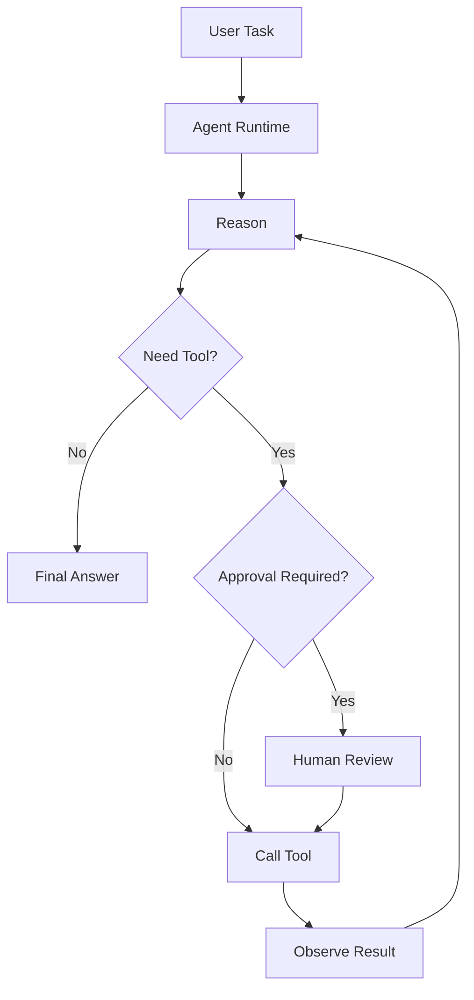

# Agent Execution

Agent execution is designed for controlled multi-step reasoning.

## Tool sources

- Knowledge search
- MCP services
- Web search
- Agent Skills

## Execution loop

An Agent run usually follows a loop:

1. Read the user task and current conversation context.
2. Decide whether the task can be answered directly or requires more information.
3. Search knowledge bases or call tools when needed.
4. Observe tool results.
5. Continue reasoning until it can produce a final answer.
6. Return the final answer with relevant evidence and tool-call metadata.

This loop makes Agent mode suitable for tasks that cannot be solved by one retrieval request.

## Agent configuration

An Agent should define:

- Instruction or system prompt.
- Allowed knowledge bases.
- Allowed MCP tools.
- Whether web search is available.
- Whether skills are available.
- Tool approval requirements.
- Model and timeout settings.

The safer default is to give Agents only the tools and knowledge they need for a specific task.

## Tool approval flow

Some tools are read-only and low risk. Others may access sensitive systems, send requests to external services, or perform operations with side effects. WeKnora can block those calls until a user approves or rejects them.

Approval is useful for:

- External API calls.
- Tools that use private credentials.
- Tools that write, delete, or trigger actions.
- Expensive or long-running operations.

## Safety model

Sensitive tools can require approval. Tool credentials should be scoped, encrypted, and separated by tenant where applicable.

## Observability

Agent runs should be inspectable. A useful trace includes:

- Model calls and token usage.
- Intermediate reasoning steps where available.
- Tool names, arguments, and results.
- Approval decisions.
- Final answer and citations.

This is important for debugging, cost control, and user trust.
