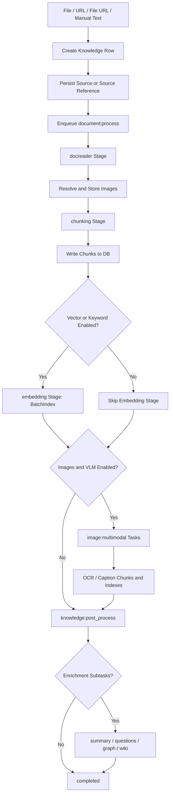

# Ingestion Pipeline

The ingestion pipeline turns uploaded files, URLs, manual text, and synced content into chunks, indexes, and optional enrichment artifacts. The request path only creates the knowledge record, saves source material, and enqueues work. Parsing, chunking, indexing, multimodal extraction, and enrichment run through Asynq workers.

## Entry Points

Most document-like sources are normalized into a `DocumentProcessPayload` and sent to the `document:process` task type:

- **Uploaded files** carry `FilePath`, `FileName`, and `FileType`.
- **Remote file URLs** carry `FileURL`; workers validate SSRF again, download the file, store it, then parse it like an upload.
- **Web URLs** carry `URL` and are parsed by a URL-capable DocReader.
- **Manual text passages** skip DocReader and go straight to chunk creation.
- **Reparse** opens a new processing attempt, resets parse status to `pending`, cleans existing chunks and indexes, and enqueues the same document task with the current process overrides.

The knowledge row starts as `pending`; when a worker accepts the task it becomes `processing`. In-flight workers check for `cancelled` and `deleting` before expensive operations so user actions can stop later stages without corrupting already-written data.

## Processing Stages

The trace timeline is intentionally a closed set of five stages:

| Stage | What happens |
| --- | --- |
| `docreader` | Selects a parser engine, reads the file or URL, and returns markdown, metadata, image references, or audio bytes. |
| `chunking` | Splits normalized markdown into `Chunk` rows, optionally using parent-child chunking. |
| `embedding` | Writes vector and keyword index entries when the knowledge base needs an embedding model. |
| `multimodal` | Runs OCR and caption extraction for stored images when VLM is enabled. |
| `postprocess` | Orchestrates summary, question generation, graph extraction, and wiki ingest. |

The stage dependency graph allows multimodal and embedding to both depend on chunking without depending on each other. Post-processing starts only after embedding is done or skipped, and after all required multimodal image tasks have either finished or exhausted retries.

## Parser Selection

Parser selection is driven by the effective process configuration for the knowledge base plus any per-document overrides. The worker resolves the parser engine by file type, with dedicated paths for URL parsing and simple local formats.

Supported reader paths include:

- built-in DocReader service for general document parsing;
- `simple` format reader for simple text-like formats;
- MinerU and MinerU Cloud readers;
- PaddleOCR-VL and PaddleOCR-VL Cloud readers;
- WeKnora Cloud signed reader when tenant cloud credentials are configured.

DocReader calls are wrapped in a bounded timeout. If parsing times out or returns an error, the `docreader` stage fails and the knowledge row is marked `failed` on the final retry.

## Image Handling

After DocReader returns markdown, the image resolver stores inline images, base64 images, relative images, and remote HTTP(S) images through the configured file service. The markdown is rewritten to provider URLs such as `local://...` or object-storage URLs.

Small decorative images are filtered out. Stored images are carried forward so the pipeline can enqueue `image:multimodal` tasks after the text chunks exist. Each image task:

- reads image bytes through the file service or SSRF-safe downloader;
- calls the VLM for OCR and caption generation;
- writes `image_ocr` and `image_caption` child chunks when text is produced;
- indexes those chunks when vector or keyword indexing is enabled;
- decrements a Redis-backed pending image counter.

When the final image task completes, the worker enqueues `knowledge:post_process`. If Redis is unavailable, the handler falls back to enqueueing post-process so the knowledge item does not remain stuck in `processing`.

## Chunking and Indexing

Chunking uses the Go chunker. The strategy can be automatic, heading-aware, heuristic, recursive, or legacy. The default chunk size is 512 characters with 80 characters of overlap, and protected regions such as links, images, tables, fenced code blocks, and block math are kept intact where possible.

Each chunk stores source offsets, sequence order, type, and optional heading context. For embedding, the document title and chunk `ContextHeader` are prepended to the chunk content so retrieval has section-level context without breaking source offsets used by highlighting and reconstruction.

The main indexing path writes only child or flat text chunks to the retrieval backend. Parent chunks are stored in the database for context expansion but are not embedded. Before re-indexing, the worker deletes old chunks, old indexes, and old graph data for the knowledge item to keep retries idempotent.

## Post-Processing

`knowledge:post_process` is an orchestrator, not a monolithic enrichment job. It loads the completed chunks, computes how many downstream subtasks are required, and either marks the item `completed` immediately or moves it to `finalizing` with `pending_subtasks_count`.

Possible subtasks are:

| Subtask | Queue | Notes |
| --- | --- | --- |
| Summary generation | `low` | Runs when text-like chunks exist. |
| Question generation | `question` | Batches plain text chunks in windows of 20 and indexes generated questions. |
| Graph extraction | `graph` | Runs per text-like chunk when graph indexing is enabled. |
| Wiki ingest | debounced task path | Adds one counted slot so wiki generation can keep the row in `finalizing`. |

Each owned subtask decrements the pending counter when it reaches a terminal state. The last decrement promotes the knowledge row to `completed`. If a planned subtask cannot be enqueued, post-process releases that slot immediately so the row is not stranded in `finalizing`.

## Status Model

| Status | Meaning |
| --- | --- |
| `pending` | A processing task has been queued but has not started. |
| `processing` | DocReader, chunking, embedding, or multimodal work is active. |
| `finalizing` | The document is already queryable for primary retrieval, but enrichment tasks are still running. |
| `completed` | Primary parsing and all enrichment subtasks reached terminal states. |
| `failed` | Processing failed and no retry remains, or a non-retryable validation error occurred. |
| `cancelled` | The user cancelled parsing; already-written chunks and indexes are preserved for inspection or reparse. |
| `deleting` | Deletion is in progress and workers should stop touching the row. |

The timeline is stored in `knowledge_processing_spans`. Stages and subspans record inputs, outputs, errors, duration, and attempt number, so a reparse has a fresh trace while Asynq retries stay attached to the same attempt.

## Operational Notes

The ingestion path is designed around retryability and observability:

- SSRF validation is repeated in workers for URLs and remote files.
- Old chunks, vector indexes, and graph data are cleaned before new content is written.
- Storage quota is checked before batch indexing.
- Embedding rate-limit errors are mapped separately from vector store write failures.
- Cancel and delete checks appear before expensive writes and model calls.
- Housekeeping can recover stale `processing` and `finalizing` rows when workers disappear.

When troubleshooting ingestion, start with the knowledge status and span tree, then inspect the failing stage: DocReader configuration, storage access, chunk creation, embedding provider, retrieval backend, VLM, or enrichment queues.
