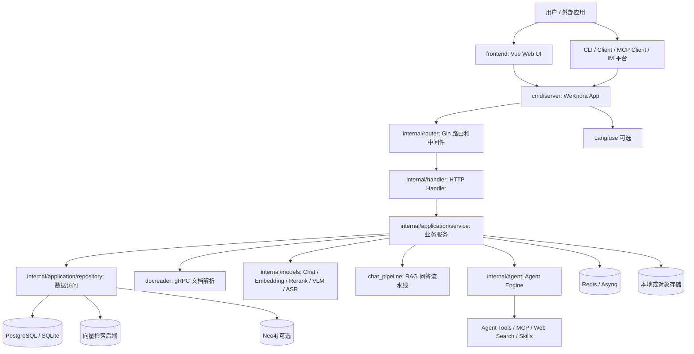
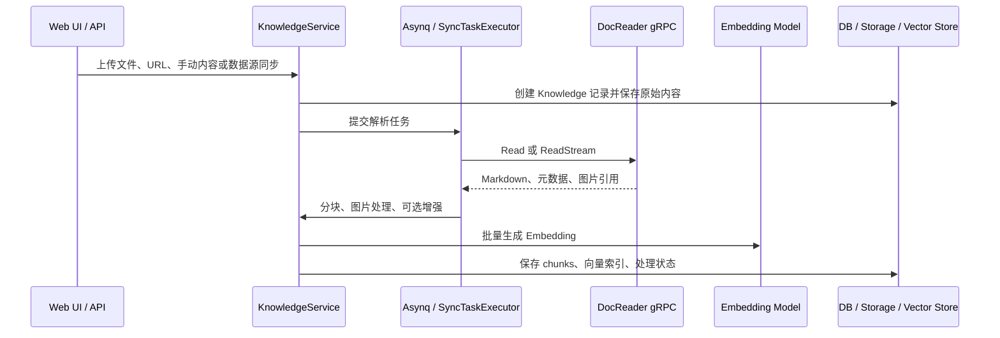

# 架构总览

WeKnora 不是单一的“RAG Demo”，而是一套围绕知识库、文档解析、检索问答、Agent 工具调用、多租户权限和外部集成组织起来的知识管理系统。

从代码结构看，核心运行时由这些部分组成：

| 层级 | 代码位置 | 职责 |
| --- | --- | --- |
| Web 前端 | `frontend/` | Vue 单页应用，负责知识库、对话、Agent、设置、组织/工作区等页面 |
| 后端入口 | `cmd/server/` | 启动 Gin HTTP 服务，加载配置，构建依赖注入容器，处理优雅退出 |
| 依赖装配 | `internal/container/` | 使用 `dig` 注册数据库、Redis、模型、检索引擎、Service、Handler、异步任务、IM/MCP/数据源等组件 |
| HTTP 路由 | `internal/router/` | 注册 `/api/v1` API、认证中间件、RBAC Guard、文件访问、IM 回调和 Swagger |
| Handler 层 | `internal/handler/` | 解析 HTTP 请求，做参数处理，把调用转给业务 Service |
| 业务 Service | `internal/application/service/` | 知识库、知识条目、分块、检索、会话、Agent、MCP、模型、租户、组织、数据源、Wiki 等核心业务 |
| Repository 层 | `internal/application/repository/` | 数据库读写、向量检索后端、Wiki 页面、任务状态等持久化访问 |
| 文档解析服务 | `docreader/` | 独立 Python gRPC 服务，把文件或 URL 解析为 Markdown、元数据和图片引用 |
| Agent 运行时 | `internal/agent/` | ReAct 式 Agent 循环、工具注册、MCP 工具、Wiki 工具、Skill 工具、审批门禁 |
| MCP Server | `mcp-server/` | 独立 Python MCP 服务，把 WeKnora API 暴露给 MCP 客户端 |
| 部署编排 | `docker-compose.yml`、`helm/` | 编排 app、frontend、docreader、postgres、redis 以及可选 Neo4j、MinIO、Langfuse、向量库等服务 |

## 运行时组件



这张图里最重要的是：**后端 App 是调度中心，但文档解析、模型调用、向量检索、对象存储、Agent 工具、IM 和 MCP 都是可替换或可扩展的外部能力。**

## 后端启动和依赖装配

后端入口在 `cmd/server/main.go`。启动过程大致是：

1. 根据 `GIN_MODE` 设置 Gin 运行模式。
2. 打印启动环境信息。
3. 调用 `container.BuildContainer` 构建依赖注入容器。
4. 执行启动钩子，例如通过 `WEKNORA_BOOTSTRAP_SYSTEM_ADMIN_EMAIL` 初始化系统管理员。
5. 从容器中取出配置、Gin Router、资源清理器和系统设置服务。
6. 启动 HTTP Server，并监听退出信号做优雅关闭。

依赖装配集中在 `internal/container/container.go`。这里会注册：

- 基础设施：配置、数据库、Redis、文件服务、Langfuse、goroutine pool。
- 外部客户端：DocReader gRPC、Ollama、Neo4j、DuckDB。
- Repository：租户、用户、知识库、知识条目、分块、模型、会话、MCP、Wiki、任务队列等。
- Service：知识库、知识入库、检索、会话问答、Agent、模型、数据源、组织、MCP、Wiki、审计日志等。
- Chat Pipeline 插件：历史加载、查询理解、并行检索、Rerank、网页抓取、合并、TopK 过滤、数据分析、Prompt 组装、流式生成等。
- Handler 和 Router。
- 异步任务：有 Redis 时使用 Asynq；没有 Redis 时使用同步执行器，主要服务 Lite 模式。

因此，理解 WeKnora 后端时，不应该只看某一个 controller，而要看 `container.go` 如何把 Repository、Service、Pipeline、Agent 和 Handler 串起来。

## HTTP API 和权限边界

HTTP 路由在 `internal/router/router.go` 中注册。

路由层的几个关键点：

- `/health` 不需要认证，用于健康检查。
- 非 release 模式下启用 `/swagger/*any`。
- Lite 版本会由后端直接服务内嵌前端静态文件。
- IM 平台回调在认证中间件之前注册，因为它们使用各平台自己的签名校验。
- 业务 API 在 `/api/v1` 下。
- 认证中间件同时支持 JWT 和租户 API Key。
- RBAC Guard 在路由层绑定，例如 Viewer、Contributor、Admin、Owner，以及知识库/Agent 的资源归属校验。

主要 API 模块包括：

- 认证、租户、成员、邀请、审计日志。
- 知识库、知识条目、FAQ、标签、分块。
- 会话、消息、普通知识问答、Agent 问答。
- 模型、向量库、网络搜索 Provider。
- MCP 服务、MCP 凭据、工具审批。
- 自定义 Agent、Skills、组织共享、IM 渠道、数据源、Wiki 页面。

这意味着 WeKnora 的权限不是只在前端做菜单隐藏，而是在路由层和 Service 层共同约束。

## 文档入库链路

文档入库主要由 `internal/application/service/knowledge*.go` 负责，DocReader 负责解析。



DocReader 的接口定义在 `docreader/proto/docreader.proto`：

- `Read`：普通文件或 URL 解析。
- `ReadStream`：先返回 Markdown 和元数据，再逐个流式返回图片，避免大扫描 PDF 触发 gRPC 消息大小限制。
- `ListEngines`：列出可用解析引擎。

DocReader 只负责解析和返回内容；图片持久化、知识条目状态、分块、Embedding 和索引写入由 Go App 负责。

## 普通知识问答链路

普通问答不是单个函数直接“检索后调用模型”，而是由 `sessionService.KnowledgeQA` 动态组装 Chat Pipeline。

核心代码在：

- `internal/application/service/session_knowledge_qa.go`
- `internal/application/service/chat_pipeline/`

当用户发起知识问答时，系统会：

1. 解析本次会话要搜索的知识库或知识条目。
2. 解析对话模型、VLM 模型、Web Search Provider 等配置。
3. 构造 `types.ChatManage`，写入 query、session、用户、检索阈值、TopK、Rerank、历史轮数、附件、图片等运行上下文。
4. 根据是否有知识库、是否启用 Web Search、是否有历史，动态组装 pipeline。
5. 通过 pipeline 执行查询理解、并行检索、Rerank、网页抓取、合并、TopK 过滤、数据分析、Prompt 组装和流式模型生成。
6. 通过 EventBus 把引用、思考内容、最终回答和错误事件流式返回给 Handler。

代码里可见的典型 RAG Pipeline 阶段包括：

```text
LOAD_HISTORY
QUERY_UNDERSTAND
CHUNK_SEARCH_PARALLEL
CHUNK_RERANK
WEB_FETCH
CHUNK_MERGE
FILTER_TOP_K
DATA_ANALYSIS
INTO_CHAT_MESSAGE
CHAT_COMPLETION_STREAM
```

如果没有知识库也没有 Web Search，则走纯聊天路径，只加载历史、可选记忆，然后直接流式调用模型。

## Agent 问答链路

Agent 问答入口在 `internal/application/service/session_agent_qa.go`。和普通 RAG 不同，AgentQA 要求传入自定义 Agent 配置。

运行过程包括：

1. 根据共享 Agent 或当前租户解析实际检索租户。
2. 从 Custom Agent 配置构造运行时 `AgentConfig`。
3. 解析对话模型；如果启用了 `knowledge_search` 工具，还必须从 Agent 配置解析 Rerank 模型。
4. 根据 Agent 设置加载多轮历史，并把历史中的工具调用展开成模型能理解的消息。
5. 调用 `agentService.CreateAgentEngine` 创建 Agent Engine。
6. 根据模型是否支持视觉，决定图片是直接传给模型，还是使用图片描述拼进 query。
7. 执行 Agent Engine，并通过 EventBus 流式输出思考、工具调用、工具观察、最终回答和错误。

Agent 工具位于 `internal/agent/tools/`，包括知识搜索、分块查询、图谱查询、网页搜索、网页抓取、MCP 工具、Skill 执行、数据分析、Wiki 页面读写等。MCP 工具审批由 `internal/agent/approval` 和 MCP Tool Approval Service 共同完成。

## 检索和存储扩展

检索后端通过 `RetrieveEngineRegistry` 和相关 repository 注册。`internal/container/container.go` 中可以看到多种后端被接入，包括：

- PostgreSQL / pgvector。
- Elasticsearch。
- OpenSearch。
- Milvus。
- Weaviate。
- Qdrant。
- Apache Doris。
- Tencent Cloud VectorDB。
- SQLite 向量检索。
- Neo4j 图谱检索。

对象存储通过文件服务抽象接入，部署时可以使用本地存储、MinIO 或云对象存储。知识库、租户和存储配置共同决定文件的落点和访问路径。

## 前端结构

前端位于 `frontend/`，使用 Vue Router。主要页面入口在 `frontend/src/router/index.ts`：

- `/platform/knowledge-bases`：知识库列表。
- `/platform/knowledge-bases/:kbId`：知识库详情。
- `/platform/agents`：Agent 列表。
- `/platform/creatChat` 和 `/platform/chat/:chatid`：创建对话和聊天页。
- `/platform/settings`：租户、模型、系统等设置。
- `/platform/organizations`：组织和共享相关页面。

前端不是独立业务系统，它通过后端 `/api/v1` 完成知识库管理、对话、Agent、模型、MCP、数据源、组织等操作。

## 部署形态

Docker Compose 中的核心服务包括：

- `frontend`：Web UI。
- `app`：Go 后端。
- `docreader`：Python gRPC 文档解析服务。
- `postgres`：主数据库，默认镜像使用 ParadeDB。
- `redis`：异步任务、缓存和部分运行时能力。

可选服务通过 profile 启用，包括：

- `sandbox`：Agent Skills 沙箱。
- `neo4j`：知识图谱。
- `minio`：本地对象存储。
- `searxng`：网络搜索。
- `qdrant`、`milvus`、`weaviate`、`doris` 等向量/检索后端。
- `dex`：OIDC 测试/集成。
- `langfuse` 相关服务：可观测性。
- `mcp`：独立 WeKnora MCP Server。

因此，WeKnora 的最小部署可以只跑核心服务；完整部署则可以按需打开图谱、对象存储、可观测性、搜索、向量库和 MCP。

## 如何继续理解代码

如果要深入某个方向，可以从这些入口继续读：

| 主题 | 建议入口 |
| --- | --- |
| API 和权限 | `internal/router/router.go`、`internal/middleware/` |
| 文档入库 | `internal/application/service/knowledge_create.go`、`knowledge_process.go`、`docreader/` |
| 普通 RAG 问答 | `internal/application/service/session_knowledge_qa.go`、`chat_pipeline/` |
| Agent | `internal/application/service/session_agent_qa.go`、`internal/agent/` |
| MCP 服务管理 | `internal/application/service/mcp_service.go`、`internal/mcp/` |
| 模型接入 | `internal/models/` |
| 检索后端 | `internal/application/service/retriever/`、`internal/application/repository/retriever/` |
| 数据源同步 | `internal/datasource/`、`internal/application/service/datasource_service.go` |
| 前端页面 | `frontend/src/router/index.ts`、`frontend/src/views/` |