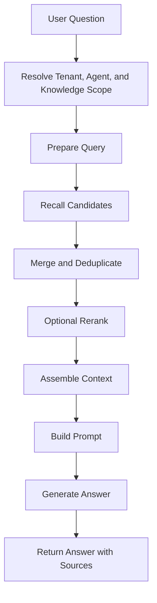

# Retrieval Pipeline

The retrieval pipeline finds the best context for a user question.

## Retrieval methods

WeKnora can combine dense vector retrieval, keyword retrieval, graph-enhanced retrieval, and reranking depending on configuration.

| Method | Strength | Best for |
| --- | --- | --- |
| Dense vector retrieval | Semantic similarity | Natural-language questions, paraphrases, conceptual matches |
| Sparse or keyword retrieval | Exact term matching | Product names, error codes, identifiers, rare words |
| Graph-enhanced retrieval | Relationship-aware expansion | Wiki and knowledge graph scenarios |
| Rerank | Better final ordering | Larger candidate pools or mixed retrieval signals |

## Scope resolution

Before retrieval starts, WeKnora must know what the question is allowed to search:

- Current tenant or workspace.
- Selected knowledge bases.
- Agent configuration.
- User permissions.
- Optional tags, source types, or resource filters.

This step prevents answers from using content the user should not access.

## Context assembly

Context assembly is the bridge between retrieval and generation. It decides which chunks fit into the model context window and how they are presented.

Important considerations:

- Preserve source metadata for citations.
- Avoid duplicate or near-duplicate chunks.
- Keep enough surrounding context for the model to understand the passage.
- Respect token limits.
- Prefer high-confidence evidence over large amounts of weak context.

## Output

The final answer should include source references so users can inspect the evidence behind the generated response.

## Quality tuning

Retrieval quality depends on both content and configuration. If answers are weak, inspect:

- Whether parsing produced clean text.
- Whether chunks are too small or too large.
- Whether the embedding model matches the document language.
- Whether keyword search is needed for identifiers.
- Whether rerank improves the final ordering.
- Whether unrelated documents should be split into separate knowledge bases.
