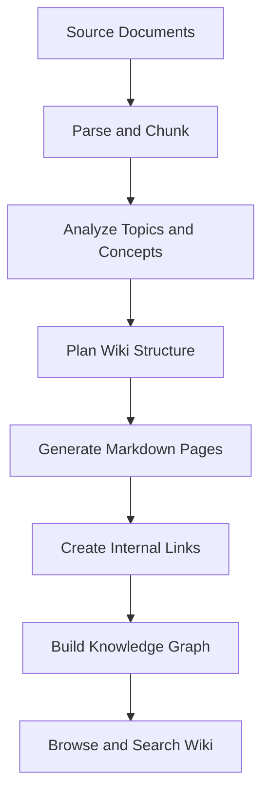

# Wiki Mode Architecture

Wiki mode creates structured knowledge from raw documents.

## Key outputs

- Markdown pages that can be read and revised.
- Links between related concepts.
- Graph views for exploration.
- Searchable content for RAG and Agent workflows.

Wiki mode is useful when the user needs a navigable knowledge base rather than only question answering.

## How Wiki mode differs from RAG

RAG uses chunks as retrieval evidence at question time. Wiki mode creates a persistent layer of structured pages before the question is asked.

| Capability | RAG | Wiki mode |
| --- | --- | --- |
| Primary output | Answer with citations | Linked Markdown knowledge base |
| Best for | Direct questions | Exploration, onboarding, knowledge organization |
| User experience | Ask and answer | Browse, inspect graph, then ask |
| Persistence | Retrieved context is temporary | Generated pages remain available |

## Page generation

Generated Wiki pages should be:

- Focused on one topic or concept.
- Linked to related pages.
- Grounded in source documents.
- Written in a maintainable Markdown format.
- Searchable and reusable by RAG and Agent workflows.

## Graph generation

The graph layer represents relationships between pages, concepts, and source material. It helps users discover neighboring topics and helps retrieval expand beyond direct keyword or vector matches.

## Review and maintenance

Generated Wiki content should be treated as a living knowledge layer. Teams should review important pages, update source documents when business knowledge changes, and regenerate or reparse when processing settings improve.
