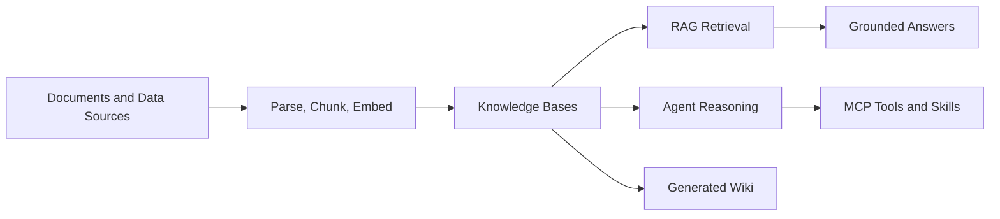

# What is WeKnora

WeKnora is an open-source knowledge management framework for teams that need to turn scattered documents into searchable, reasoned, and continuously evolving knowledge assets.

Most RAG systems stop at "upload documents and ask questions". WeKnora goes further by combining document ingestion, hybrid retrieval, Agent tool use, Wiki generation, tenant-level access control, and self-hosted deployment into one framework.

## What WeKnora provides

WeKnora combines three major product capabilities:

- **RAG question answering** for reliable answers grounded in uploaded or synchronized knowledge.
- **Agent reasoning** for multi-step tasks that can combine knowledge search, MCP tools, web search, and custom skills.
- **Wiki generation** for transforming raw documents into linked Markdown pages and knowledge graphs.

Around those capabilities, WeKnora also provides the operational pieces needed to run a real knowledge system:

- Multi-tenant workspaces and role-based access control.
- Pluggable model providers for chat, embedding, rerank, VLM, and ASR workloads.
- Replaceable vector stores, object storage backends, document parsers, web search providers, and IM connectors.
- MCP service management and tool approval for controlled Agent execution.
- Langfuse-based tracing for model calls, Agent steps, and ingestion pipelines.
- Web UI, REST API, CLI, MCP server, Chrome extension, and messaging integrations.

## Who should use WeKnora

WeKnora is useful for:

- Product and engineering teams building internal knowledge assistants.
- Organizations that need private RAG over business documents.
- Developers building Agent workflows that need controlled tool execution.
- Teams that want document-to-Wiki workflows instead of only document search.

It is especially useful when you need a self-hosted or private-cloud deployment where documents, credentials, model choices, and retrieval infrastructure stay under your control.

## How it works at a high level

1. Content enters WeKnora through uploads, URLs, data source synchronization, or manual entries.
2. The ingestion pipeline parses documents, creates chunks, generates embeddings, and writes indexes.
3. Users ask questions through the Web UI, API, CLI, IM channels, or other clients.
4. WeKnora retrieves relevant knowledge, optionally reranks it, and sends grounded context to the model.
5. Agents can go beyond direct answers by calling tools, searching the web, or executing approved skills.
6. Wiki mode can transform source documents into linked Markdown pages and a browsable knowledge graph.

## Main interfaces

WeKnora can be used through multiple interfaces:

| Interface | Use case |
| --- | --- |
| Web UI | Daily knowledge management, chat, Wiki browsing, and configuration |
| REST API | Application integration and automation |
| CLI | Developer workflows and scripted operations |
| MCP Server | Exposing WeKnora capabilities to MCP-compatible clients |
| IM channels | Asking questions from enterprise messaging tools |
| Chrome extension | Capturing web content into knowledge bases |
| WeChat Mini Program | Lightweight mobile usage |

## What to read next

If you are new to WeKnora, read in this order:

1. [Core Concepts](./core-concepts.md) to understand the vocabulary.
2. [Quick Start](./quick-start.md) to run WeKnora locally.
3. [Architecture Overview](./architecture/overview.md) to understand the system components.
4. [Document Ingestion](./user-guide/document-ingestion.md) and [Chat and RAG](./user-guide/chat-and-rag.md) for the first end-to-end workflow.
