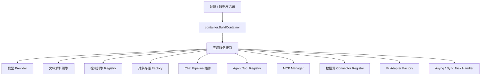

# 扩展点设计

WeKnora 的扩展点不是单一插件目录，而是由接口、注册表、依赖注入、配置化 provider 和任务路由共同组成。新增能力时，优先判断它属于哪一层：模型调用、文档解析、检索引擎、对象存储、Chat Pipeline、Agent 工具、MCP、数据源、IM 连接器或异步任务。

核心原则是：扩展实现可以替换，但业务服务只依赖稳定接口；凭据必须走已有配置和加密路径；注册点必须清晰；失败要能被 API、日志或健康检查定位。



## 依赖注入边界

主注册点在 `internal/container/container.go` 的 `BuildContainer`。仓储、服务、任务 handler、HTTP handler、检索插件、Web Search provider、数据源 connector、IM adapter factory 都在这里完成 wiring。

新增扩展时通常需要确认三件事：

| 问题 | 典型位置 |
| --- | --- |
| 业务代码依赖哪个接口？ | `internal/types/interfaces/*` |
| 实现在哪里创建？ | `internal/application/service/*`、`internal/application/repository/*`、`internal/infrastructure/*`、`internal/agent/tools/*` |
| 何时注册进系统？ | `internal/container/container.go`、对应 registry 的 `Register` 调用、或包内 `init()` |

如果能力需要被 HTTP API 暴露，还需要在 `internal/router/router.go` 中注册路由，并按资源所有权选择 RBAC guard。不要在 handler 中直接绕过 service 或 repository；当前代码大多通过接口层保持测试替换和租户隔离。

## 模型 Provider

模型扩展分为两层。

第一层是 provider 元数据和配置校验，位于 `internal/models/provider`。新增模型供应商时通常需要：

1. 增加 `ProviderName` 常量。
2. 在 `AllProviders()` 中加入展示顺序。
3. 实现 `Provider` 接口，提供 `Info()` 和 `ValidateConfig()`。
4. 在对应 provider 文件中通过 `provider.Register(...)` 注册。
5. 如果可通过 BaseURL 识别，在 `DetectProvider()` 中补充识别规则。

`ProviderInfo` 描述展示名称、默认 URL、支持的 `ModelType`、是否需要认证、额外字段等。模型记录本身通过 `ModelService` 管理，运行时再根据 `model_type` 解析为具体能力：

- `GetEmbeddingModel`
- `GetRerankModel`
- `GetChatModel`
- `GetVLMModel`
- `GetASRModel`

第二层是 Chat 协议适配，位于 `internal/models/chat/provider.go`。多数供应商使用 OpenAI 兼容接口，但仍存在差异，例如：

- 鉴权头不同：Bearer、`api-key`、或 WeKnoraCloud 签名。
- thinking 参数位置不同：`enable_thinking`、`thinking.type`、`chat_template_kwargs`。
- reasoning 模型需要删除 sampling 参数。
- 部分 provider 不支持 `tool_choice`。
- Gemini 需要保留 tool call metadata 以支持跨轮 replay。

这些差异由 `providerAdapter` 承担。新增 OpenAI 兼容供应商时，不要把特殊逻辑散落到业务服务中；应嵌入 `baseProvider` 并只覆盖必要方法。

## 文档解析引擎

文档解析的统一接口是：

```go
type DocReader interface {
    Read(ctx context.Context, req *types.ReadRequest) (*types.ReadResult, error)
}
```

远端 docreader 客户端还实现 `DocumentReader`，支持 `Reconnect`、`IsConnected` 和 `ListEngines`。解析请求使用 `types.ReadRequest`，可携带文件内容、URL、文件类型、解析引擎名称和引擎级 overrides；结果统一返回 Markdown、图片引用、音频数据和 metadata。

解析引擎发现有两条路径：

- 本地注册：`internal/infrastructure/docparser/engine_registry.go` 中的 `RegisterEngine`，当前注册了 `builtin`、`simple`、`weknoracloud`、`mineru`、`mineru_cloud`、`paddleocr_vl`、`paddleocr_vl_cloud`。
- 远端发现：docreader 的 `ListEngines` 返回远端支持的引擎。`ListAllEngines` 会合并本地和远端结果，远端同名引擎的 file types 和 description 优先。

如果新增 Go-native 解析器，需要实现 `EngineRegistration`，并在 `init()` 中注册。每个引擎必须说明：

- `Name()`
- `Description()`
- `FileTypes(docreaderConnected bool)`
- `CheckAvailable(docreaderConnected bool, overrides map[string]string)`

如果新增 Python docreader 引擎，Go 侧不一定需要同步改代码，只要远端能通过 `ListEngines` 暴露元数据即可。需要注意的是，业务解析仍要能通过 `ReadRequest.ParserEngine` 路由到对应实现。

## 检索引擎和向量库

检索引擎接口分为三层：

- `RetrieveEngine`：提供 `EngineType()`、`Retrieve()` 和 `Support()`。
- `RetrieveEngineRepository`：负责索引保存、批量保存、删除、复制、状态更新等存储操作。
- `RetrieveEngineService`：把 repository 与 embedding 过程组合，面向知识入库和检索服务。

检索引擎注册表 `RetrieveEngineRegistry` 有两张 map：

| 注册方式 | 用途 |
| --- | --- |
| `byEngineType` | 兼容环境变量 `RETRIEVE_DRIVER` 的默认引擎注册。 |
| `byStoreID` | 支持 `vector_stores` 表中按实例注册多个同类型向量库。 |

环境变量路径在容器初始化时读取 `RETRIEVE_DRIVER`，可注册 Postgres、SQLite、Elasticsearch、OpenSearch、Qdrant、Weaviate、Milvus、Doris、Tencent VectorDB 等。DB 管理的向量库由 `VectorStoreService` 创建和校验，创建成功后通过 `EngineFactory` 生成 engine service 并 `RegisterWithStoreID`。

新增向量库通常需要：

1. 在 `types.RetrieverEngineType` 中增加引擎类型。
2. 实现 `RetrieveEngineRepository` 或等价 repository。
3. 用 `retriever.NewKVHybridRetrieveEngine` 包装为 `RetrieveEngineService`，或实现完整 service。
4. 在 `initRetrieveEngineRegistry` 中加入环境变量注册路径。
5. 在 `NewEngineFactory` 中加入 DB store 创建路径。
6. 在 `types.VectorStore` 校验、连接配置、索引配置和 handler DTO 中暴露必要字段。

安全约束也在这层执行。用户创建的 VectorStore 会经过 engine 类型白名单、连接参数校验、SSRF 地址校验、索引配置校验、重复 endpoint/index 检查和连接测试。连接配置中的密码和 API key 通过 `ConnectionConfig.Value()` 加密保存，读取时解密。

## 对象存储

对象存储通过 `internal/application/service/file/factory.go` 的 `NewFileServiceFromStorageConfig` 创建。它不是 registry，而是根据租户 `StorageEngineConfig` 和 provider 名称走 switch 分派。

当前支持的 provider 包括：

- `local`
- `minio`
- `cos`
- `tos`
- `s3`
- `obs`
- `oss`
- `ks3`

新增对象存储时，需要实现 `interfaces.FileService`，再在 factory 中新增 provider 分支，并补充租户配置结构、凭据校验和前端/接口展示。路径类配置要使用已有安全工具约束在允许目录内，避免任意路径写入。

## Chat Pipeline 插件

问答链路通过 `internal/application/service/chat_pipeline` 的事件插件机制扩展。插件接口是：

```go
type Plugin interface {
    OnEvent(ctx context.Context, eventType types.EventType, chatManage *types.ChatManage, next func() *PluginError) *PluginError
    ActivationEvents() []types.EventType
}
```

插件注册到 `EventManager` 后，会按事件类型构造 `next()` 调用链。当前容器中注册的插件包括搜索、rerank、Web Fetch、上下文合并、数据分析、消息组装、非流式/流式模型调用、TopK 过滤、问题理解、历史加载、实体抽取、实体搜索、并行搜索、Wiki Boost 和 Memory。

新增 Chat Pipeline 插件时要明确：

- 它监听哪个 `types.EventType`。
- 它应该在 `next()` 前执行还是后执行。
- 它读写 `types.ChatManage` 的哪些字段。
- 失败时返回哪个 `PluginError`。
- 是否需要在 Langfuse、pipeline log 或结构化日志中输出可诊断信息。

例如 Wiki Boost 插件监听 `CHUNK_RERANK`，先执行下游 rerank，再把 `wiki_page` chunk 的得分乘以 1.3 并重新排序。

## Agent 工具

Agent 工具统一实现 `types.Tool`：

```go
type Tool interface {
    Name() string
    Description() string
    Parameters() json.RawMessage
    Execute(ctx context.Context, args json.RawMessage) (*ToolResult, error)
}
```

工具通过 `ToolRegistry` 注册。注册策略是 first-wins：如果已有同名工具，后注册工具会被拒绝，以避免工具名劫持。执行前系统会：

1. 按 JSON Schema 做参数类型转换。
2. 校验参数。
3. 执行工具。
4. 截断过长输出，避免污染上下文窗口。
5. 对失败结果追加提示，引导模型换一种方式重试。

新增内置工具时，需要：

- 在 `internal/agent/tools/definitions.go` 增加工具名。
- 实现工具结构，通常嵌入 `BaseTool`。
- 给 `Parameters()` 提供 JSON Schema。
- 在 `AgentService` 的工具注册 switch 中按能力条件注册。
- 如果工具应出现在 UI 配置中，同步更新 `AvailableToolDefinitions()` 和默认工具集合。

Wiki 工具、数据分析工具、Web Search 工具和 Skill 工具都遵循这个机制。若工具持有临时资源，可实现 `types.Cleanable`，Agent 结束时 registry 会调用 `Cleanup()`。

## MCP 服务

MCP 是外部工具扩展的运行时入口。租户配置的 MCP 服务由 `MCPServiceService` 管理，连接由 `MCPManager` 复用和清理。

关键规则：

- SSE 和 HTTP Streamable 连接会缓存复用。
- Stdio transport 在 manager 中被禁用，原因是安全风险。
- 初始化有超时限制，服务可通过 advanced config 调整，但最大 60 秒。
- `UpdateMCPCredentials` 和 `ClearMCPCredential` 会关闭已有 client，确保下次调用使用新凭据。
- Agent 会通过 `RegisterMCPTools` 拉取 MCP 服务的 tool 列表，并把每个远端 tool 包装成内置 `types.Tool`。
- MCP tool 输出会加上“不可信数据”的前缀，避免远端工具结果被模型当成系统指令。
- MCP 图片输出有数量、大小和 MIME 白名单限制。
- 高风险 MCP 工具可接入 human-in-the-loop approval gate。

新增 MCP 能力通常不需要改 Agent 工具接口；只要远端 MCP 服务能正确暴露工具 schema，WeKnora 会在会话注册阶段把它包装进 ToolRegistry。

## Skill

Skill 是 Agent 的渐进式能力扩展。服务层通过 `SkillService` 暴露预置 Skill 元数据和完整内容，Agent 侧通过 `read_skill` 和 `execute_skill_script` 工具按需加载。

Skill 管理器会扫描配置目录中的 `SKILL.md`，读取元数据、指令和附加文件。`AllowedSkills` 为空时允许全部；不为空时按白名单过滤。系统提示词只注入 Skill metadata，真正的长指令由模型在需要时调用 `read_skill` 加载，避免每轮都把所有 Skill 内容塞进上下文。

新增 Skill 时，重点不在 Go 代码，而在目录结构和 `SKILL.md` 质量。需要提供清晰的触发条件、操作步骤、可选脚本和安全边界。

## Web Search Provider

Web Search provider 使用 `internal/infrastructure/web_search.Registry`。注册表保存 provider type 到 factory 的映射，运行时按租户配置创建实例。

当前容器注册了：

- `duckduckgo`
- `google`
- `bing`
- `tavily`
- `ollama`
- `baidu`
- `searxng`

新增 provider 时，需要实现 `interfaces.WebSearchProvider`，提供 factory，并在 `registerWebSearchProviders` 中注册。Provider 参数来自 `types.WebSearchProviderParameters`，凭据由 Web Search Provider 服务和 credentials handler 管理，避免把 API key 放入普通配置响应。

## 数据源 Connector

数据源同步通过 `internal/datasource.Connector` 扩展。接口包括：

- `Type()`
- `Validate()`
- `ListResources()`
- `FetchAll()`
- `FetchIncremental()`

当前实际注册的 connector 是 Feishu、Notion 和 Yuque。`ConnectorMetadataRegistry` 中还预留了 Confluence、GitHub、Google Drive、OneDrive、DingTalk、Web Crawler、Slack、IMAP、RSS 等展示 metadata，但只有注册到 `ConnectorRegistry` 的实现才能被真正调用。

新增数据源时需要：

1. 在 `internal/datasource/connector/<name>` 下实现 connector。
2. 在 `initConnectorRegistry` 中注册。
3. 在 `ConnectorMetadataRegistry` 中补充名称、认证方式、能力和展示优先级。
4. 确认同步结果能转换为 `types.FetchedItem`，后续走标准文档入库链路。
5. 如果支持增量同步，正确维护 `types.SyncCursor`。

容器初始化会聚合 connector 注册错误；重复或错误注册会让启动失败，而不是静默禁用。

## IM Adapter

IM 集成位于 `internal/im`。每个平台实现 `Adapter`：

- `Platform()`
- `VerifyCallback()`
- `ParseCallback()`
- `SendReply()`
- `HandleURLVerification()`

平台还可以实现可选接口：

- `StreamSender`：支持流式回复。
- `FileDownloader`：支持从 IM 下载文件并写入知识库。

当前平台类型包括 WeCom、Feishu、Slack、Telegram、DingTalk、Mattermost、WeChat。容器通过 `registerIMAdapterFactories` 注册各平台 factory，然后加载数据库中启用的 IM channel。

新增 IM 平台时，不要把平台字段泄漏到业务问答流程中；adapter 应把回调转换成统一的 `IncomingMessage`，发送侧使用统一的 `ReplyMessage`。如果平台有 thread、quote、文件或流式能力，应通过统一字段或可选接口表达。

## 异步任务

异步任务统一实现 `interfaces.TaskHandler`：

```go
type TaskHandler interface {
    Handle(ctx context.Context, t *asynq.Task) error
}
```

生产模式使用 asynq server，Lite 或测试场景可使用 `SyncTaskExecutor`。任务类型在 `internal/types/task.go` 中定义，路由在 `internal/router/task.go` 和 `internal/router/sync_task.go` 中注册。

当前任务包括文档处理、手动重解析、FAQ 导入、问题生成、摘要生成、KB 克隆、知识移动、删除、索引删除、图片多模态、后处理、数据源同步和 Wiki 入库等。

新增任务时需要：

- 定义明确的 task type。
- 设计可序列化 payload。
- 实现 handler 或 service 方法。
- 同时注册到 asynq 和 sync executor。
- 明确重试、超时、死信、追踪和幂等策略。

如果任务会影响文档解析状态，还必须接入已有的 finalizing/subtask 计数或清理机制，避免文档长期卡在处理中。

## HTTP API 和 RBAC

新增对外接口需要走 handler + router + RBAC guard。路由层已经按资源类型拆分注册函数，例如模型、知识库、MCP、Web Search、VectorStore、Agent、Skill、DataSource、IM、Wiki 等。

选择 guard 时要区分：

- 租户级基础设施：模型、VectorStore、IM channel、MCP 等通常需要 Admin 或更高权限。
- KB 内容资源：知识、chunk、Wiki 页面、FAQ 等需要按知识库所有权或 Viewer/Contributor 能力控制。
- 公开回调：IM 平台 callback、认证入口等不能复用普通用户态鉴权，需要单独验证签名、token 或 challenge。

扩展接口时不要只看前端入口；必须确认 handler 是否做了 tenant ID 解析、资源归属校验、敏感字段脱敏和错误分类。

## 扩展检查清单

新增扩展前，建议按这份清单检查：

- 是否已有接口可以复用，而不是新增平行抽象？
- 新实现是否注册到了容器、registry 或 `init()`？
- 英文/中文展示名、能力列表和 UI metadata 是否同步？
- 凭据是否走 credentials handler 或加密字段，而不是普通 update 覆盖？
- 是否有连接测试或 `CheckAvailable`？
- 是否有超时、重试、死信或断线重连策略？
- 是否保留租户隔离和资源所有权检查？
- 是否能被日志、stats、lint、healthcheck 或 API 错误定位？
- 是否有单元测试覆盖注册、配置校验、失败路径和安全边界？

把扩展点放在这些边界内，后续升级 provider、替换基础设施或增加连接器时，业务链路就不需要感知具体实现细节。
