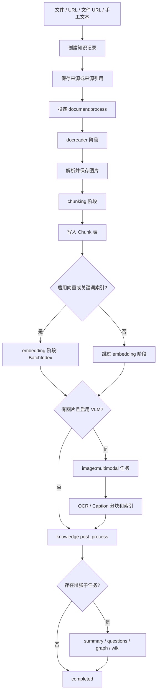

# 文档入库链路

入库链路把上传文件、URL、手工文本和同步内容转成分块、索引和可选增强结果。请求链路只负责创建知识记录、保存来源材料并投递任务；解析、切分、索引、多模态抽取和后处理都由 Asynq worker 异步完成。

## 入口

大多数文档类来源都会被规范成 `DocumentProcessPayload`，再投递到 `document:process` 任务：

- **上传文件**携带 `FilePath`、`FileName` 和 `FileType`。
- **远程文件 URL**携带 `FileURL`；worker 会再次做 SSRF 校验，下载文件，保存后按上传文件解析。
- **网页 URL**携带 `URL`，由支持 URL 的 DocReader 解析。
- **手工文本段落**跳过 DocReader，直接进入分块创建。
- **重解析**会打开新的处理 attempt，把状态重置为 `pending`，清理旧分块和旧索引，再带上当前处理配置投递同样的文档任务。

知识记录初始为 `pending`；worker 接收任务后变为 `processing`。执行重操作前，worker 会检查知识是否已经进入 `cancelled` 或 `deleting`，让用户取消和删除操作可以阻断后续阶段，同时不破坏已经写入的数据。

## 处理阶段

处理时间线固定为五个阶段：

| 阶段 | 作用 |
| --- | --- |
| `docreader` | 选择解析引擎，读取文件或 URL，返回 Markdown、元数据、图片引用或音频字节。 |
| `chunking` | 把标准化后的 Markdown 切成 `Chunk` 记录，可选父子分块。 |
| `embedding` | 当知识库需要 embedding 模型时，写入向量和关键词索引。 |
| `multimodal` | 当启用 VLM 时，对已保存图片执行 OCR 和 caption 抽取。 |
| `postprocess` | 统一调度摘要、问题生成、图谱抽取和 Wiki 入库。 |

阶段依赖关系里，`embedding` 和 `multimodal` 都依赖 `chunking`，但二者互不依赖。后处理会等待 embedding 完成或跳过，并等待所有需要的多模态图片任务完成或耗尽重试后再开始。

## 解析器选择

解析器由知识库的有效处理配置决定，单个文档的 process overrides 可以覆盖知识库默认值。worker 会按文件类型解析 parser engine，URL 和简单本地格式有专门路径。

当前代码路径支持：

- 通用文档解析的内置 DocReader 服务；
- 简单文本类格式的 `simple` reader；
- MinerU 和 MinerU Cloud reader；
- PaddleOCR-VL 和 PaddleOCR-VL Cloud reader；
- 配置了租户云凭证时的 WeKnora Cloud signed reader。

DocReader 调用有独立超时保护。解析超时或返回错误时，`docreader` 阶段失败；如果已经是最后一次重试，知识记录会标记为 `failed`。

## 图片处理

DocReader 返回 Markdown 后，image resolver 会通过配置的文件服务保存内联图片、base64 图片、相对路径图片和远程 HTTP(S) 图片。Markdown 中的图片引用会被改写为 `local://...` 或对象存储 URL 这类 provider URL。

很小的装饰图片会被过滤。保存后的图片会被带到后续流程，等文本 chunk 创建完成后再投递 `image:multimodal` 任务。每个图片任务会：

- 通过文件服务或 SSRF-safe downloader 读取图片字节；
- 调用 VLM 生成 OCR 文本和 caption；
- 有有效文本时写入 `image_ocr` 和 `image_caption` 子 chunk；
- 当启用向量或关键词索引时，为这些子 chunk 建索引；
- 递减 Redis 中的图片待处理计数。

最后一个图片任务完成后，worker 会投递 `knowledge:post_process`。如果 Redis 不可用，处理器会兜底投递后处理任务，避免知识长期停在 `processing`。

## 分块和索引

分块使用 Go chunker。策略可以是自动、标题感知、启发式、递归或 legacy。默认 chunk 大小为 512 字符，overlap 为 80 字符；链接、图片、表格、代码块和块级数学公式等受保护区域会尽量避免被切断。

每个 chunk 会保存来源偏移、顺序、类型和可选标题上下文。生成 embedding 时，文档标题和 chunk 的 `ContextHeader` 会被拼到正文前面，让检索获得章节语义，同时不破坏用于高亮和重建原文的 source offset。

主索引路径只把子文本 chunk 或普通扁平文本 chunk 写入检索后端。父 chunk 保存在数据库中用于上下文扩展，但不会生成 embedding。重解析或重试写新内容前，worker 会先删除该知识的旧 chunk、旧索引和旧图谱数据，保证处理幂等。

## 后处理

`knowledge:post_process` 是调度器，不是把所有增强工作都同步执行的长任务。它会加载已完成的 chunk，计算需要多少下游子任务，然后立即完成，或把知识置为 `finalizing` 并写入 `pending_subtasks_count`。

可能投递的子任务包括：

| 子任务 | 队列 | 说明 |
| --- | --- | --- |
| 摘要生成 | `low` | 存在文本类 chunk 时运行。 |
| 问题生成 | `question` | 按 20 个普通文本 chunk 一批生成问题，并为生成问题建索引。 |
| 图谱抽取 | `graph` | 启用图谱索引时，按文本类 chunk 逐个抽取。 |
| Wiki 入库 | 去抖批处理路径 | 计为一个槽位，让 Wiki 生成期间知识保持在 `finalizing`。 |

每个拥有槽位的子任务进入终态后都会递减 pending 计数。最后一个递减者会把知识状态推进到 `completed`。如果某个计划中的子任务没有成功投递，后处理会立刻释放对应槽位，避免知识卡在 `finalizing`。

## 状态模型

| 状态 | 含义 |
| --- | --- |
| `pending` | 处理任务已经排队，但尚未开始。 |
| `processing` | DocReader、分块、embedding 或多模态处理正在运行。 |
| `finalizing` | 主检索链路已经可查询，但增强子任务仍在运行。 |
| `completed` | 主解析和所有增强子任务都已进入终态。 |
| `failed` | 处理失败且不再重试，或出现不可重试的校验错误。 |
| `cancelled` | 用户取消了解析；已经写入的 chunk 和索引会保留，便于查看或重解析。 |
| `deleting` | 删除正在进行中，worker 应停止触碰这条知识记录。 |

时间线存储在 `knowledge_processing_spans`。stage 和 subspan 会记录输入、输出、错误、耗时和 attempt 编号，因此重解析会产生新的 trace，而 Asynq 重试仍归属于同一次 attempt。

## 运维要点

入库链路围绕可重试和可观测设计：

- URL 和远程文件会在 worker 内再次做 SSRF 校验。
- 写入新内容前会清理旧 chunk、向量索引和图谱数据。
- 批量索引前会检查租户存储配额。
- embedding 限流错误会和向量库写入失败区分编码。
- 昂贵写入和模型调用前会检查取消和删除状态。
- housekeeping 可以恢复 worker 消失后遗留的 `processing` 和 `finalizing` 记录。

排查入库问题时，先看知识状态和 span tree，再定位失败阶段：DocReader 配置、存储访问、chunk 创建、embedding provider、检索后端、VLM 或增强任务队列。
