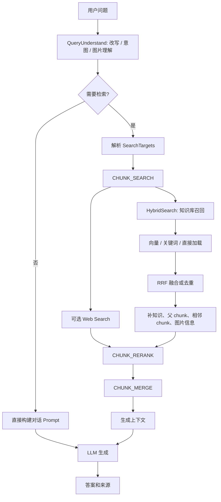

# 检索链路

WeKnora 的检索链路分两层：底层 `HybridSearch` 负责从知识库召回和整理候选 chunk；上层聊天管线负责理解问题、并发搜索、rerank、合并上下文，最后把证据交给 LLM 生成回答。



## 入口

检索入口主要有两类：

- **知识库搜索 API**：直接调用 `KnowledgeBaseService.HybridSearch`，返回 `SearchResult` 列表，不负责生成回答。
- **聊天和 Agent 问答**：通过 chat pipeline 依次触发 `QUERY_UNDERSTAND`、`CHUNK_SEARCH`、`CHUNK_RERANK`、`CHUNK_MERGE` 等事件，再进入 prompt 组装和模型生成。

这两类入口共用同一套知识库召回能力，但聊天链路会额外处理历史、Web Search、rerank、上下文合并和流式事件。

## 范围和权限

检索前必须先确定允许搜索哪些内容。范围来自会话、Agent 配置、选定知识库、指定知识条目、标签过滤和共享知识库权限。

`HybridSearch` 会批量加载待搜索知识库，并逐个做访问校验：

- 当前租户自己的知识库可以直接访问。
- 其他租户的共享知识库必须通过共享权限校验。
- 多知识库检索必须使用一致的 embedding 模型空间，否则跨模型分数没有可比性。
- wiki-only 或 graph-only 知识库没有向量/关键词索引时，会在普通召回中优雅返回空结果，而不是让组合检索失败。

聊天管线会先把 SearchTargets 按底层 embedding 模型身份分组。这个身份不只看模型 ID，还看模型名称和 endpoint，目的是让共享知识库和本租户知识库在使用同一物理模型时复用一次 query embedding。

## HybridSearch

`HybridSearch` 的核心流程是：

1. 确定本次搜索的知识库 ID 列表。
2. 批量加载知识库，完成权限和 embedding 模型一致性校验。
3. 选出 primary 知识库，用它决定 query embedding 和 FAQ 相关处理。
4. 计算过量召回数量：按 `MatchCount * 5` 放大，单次搜索最低 50，整体最多 500。
5. 在需要向量召回时，只生成一次 query embedding，并传给后续 store group。
6. 按 `(vector_store_id, owner tenant)` 将知识库分组，为每组解析对应检索引擎。
7. 对每个组构建 vector / keyword `RetrieveParams`，并发调用底层检索后端。
8. 将原始召回结果分成向量结果和关键词结果，做融合或去重。
9. 回表补齐知识和 chunk 信息，按需扩展上下文。

底层检索通过 `CompositeRetrieveEngine` 分发到实际后端。一个知识库可以绑定独立的 Vector Store；没有绑定时，使用租户的有效检索引擎配置。

## 召回方式

| 方式 | 触发条件 | 说明 |
| --- | --- | --- |
| 向量召回 | 知识库启用 vector indexing，且未禁用 vector match | 使用 query embedding 查询语义相似 chunk。 |
| 关键词召回 | 文档型知识库启用 keyword indexing，且未禁用 keyword match | 面向标识符、产品名、错误码和精确词。 |
| FAQ 召回 | FAQ 类型知识库启用向量索引 | FAQ 使用独立索引路径，不走文档关键词索引。 |
| 直接加载 | 聊天目标指定具体知识条目且 chunk 数不大 | 小文档直接加载全部 chunk，分数视为强匹配。 |
| Web Search | 会话或 Agent 启用 Web Search provider | 和知识库搜索并发执行，结果统一进入 rerank/merge。 |

聊天管线中，如果普通召回结果太少且启用了 Query Expansion，会额外尝试偏关键词的扩展搜索，补充低召回场景。

## 融合和去重

当只有一种召回来源时，系统按 chunk ID 去重，保留最高分。当向量和关键词都有结果时，使用加权 RRF 融合：

```text
RRF score = vectorWeight / (k + vectorRank) + keywordWeight / (k + keywordRank)
```

`k`、向量权重和关键词权重来自租户 retrieval config，没有配置时使用默认值。RRF 使用排名而不是原始分数，能降低不同检索后端分数尺度不一致带来的影响。

融合后，系统会截断到请求的 `MatchCount`，再进入结果组装。

## 结果组装

原始检索结果只包含索引层信息。`processSearchResults` 会再做一轮数据库补全：

- 批量加载命中的知识记录，用于标题、来源、文件名、channel 和 metadata。
- 批量加载命中的 chunk，过滤不可搜索的 chunk 类型。
- 在未禁用上下文扩展时，补充父 chunk、关联 chunk 和相邻 chunk。
- 对图片 OCR / caption 命中，补齐图片信息。
- 生成统一的 `SearchResult`，携带 `MatchType`、分数、位置、chunk 类型和来源字段。

可返回的 chunk 类型包括普通文本、摘要、表格列/摘要、FAQ、图片 OCR 和图片 caption。父 chunk、相邻 chunk、关系 chunk 会以不同 `MatchType` 标记，便于前端和后续管线解释来源。

## Rerank

聊天和 Agent 问答会在召回后进入 `CHUNK_RERANK`。Rerank 不是必需步骤：没有配置 rerank 模型、没有候选结果，或当前意图不需要检索时都会跳过。

Rerank 前会清理 passage：

- 去掉 Markdown 图片、URL、HTML 标签、代码块、表格分隔符等结构噪声。
- 保留链接文本、标题文本和表格单元格文本。
- 把图片 caption、OCR 文本和已生成问题作为增强文本拼入 passage。
- `DirectLoad` 结果不送入 rerank 模型，直接保留为强相关候选。

Rerank 模型返回相关性分数后，系统会按阈值过滤。如果阈值太高导致没有结果，会降级重试；如果仍然没有结果但最高分不低于安全下限，会保留 top1。模型调用失败时，管线回退到原始召回候选，避免因为 rerank provider 故障导致整次问答失败。

最终分数会综合模型分、原始召回分和来源权重，并对 FAQ 结果应用可配置 boost。之后再用 MMR 选择 TopK，在相关性和多样性之间折中，减少重复证据挤占上下文。

## Merge 和上下文扩展

`CHUNK_MERGE` 决定最终进入 LLM 的上下文。它优先使用 rerank 结果；如果 rerank 没有结果，则按召回分数回退到 search result。

合并流程包括：

1. 按 chunk ID 和内容签名做初步去重。
2. 注入历史轮次中仍相关的知识引用。
3. 对父子分块命中，解析父 chunk，用更完整的父级内容替换短子块上下文。
4. 按知识和 chunk 类型分组，合并位置重叠的片段。
5. 对 FAQ chunk 补充答案内容。
6. 对过短文本 chunk 拉取前后相邻 chunk，扩展到合适长度。
7. 再次合并扩展后产生的重叠片段。
8. 做最终去重，并移除被高分片段大量包含的弱重复内容。

这一步的目标不是继续提高召回数量，而是把候选证据整理成适合 LLM 阅读的、重复较少的上下文。

## 图谱和 Wiki 相关检索

图谱和 Wiki 不是普通向量/关键词召回的简单替代品。图谱抽取结果会写入图谱后端，聊天管线可以通过实体检索路径补充图谱相关 chunk；Wiki 模式则依赖页面结构、链接关系和专门的 Wiki 服务能力。

当知识库只启用 Wiki 或 Graph 而没有 vector/keyword 索引时，`HybridSearch` 会返回空候选，避免普通检索误用一个没有可检索索引的知识库。需要图谱或 Wiki 体验时，应走对应的 Agent 工具或 Wiki 页面能力。

## 质量调优

回答质量问题通常要按链路定位：

- **没有召回**：检查知识库是否启用向量或关键词索引、embedding 模型是否一致、知识是否完成入库、权限范围是否正确。
- **召回弱相关**：检查 chunk 大小、overlap、标题上下文、embedding 模型语言适配和阈值。
- **标识符搜不到**：启用或调高关键词检索权重，避免只依赖语义向量。
- **候选重复**：检查分块是否过碎，观察 RRF、MMR 和 merge 去重日志。
- **Rerank 后为空**：检查 rerank 阈值、模型返回分数和 passage 清洗后的内容。
- **上下文不完整**：检查父子分块、相邻 chunk 扩展和 `SkipContextEnrichment` 是否被调用方禁用。

排查时建议先看 chat pipeline 日志中的 Search、Rerank、Merge 阶段，再回到 `HybridSearch` 的 retrieve span、store group 和底层检索后端日志。
