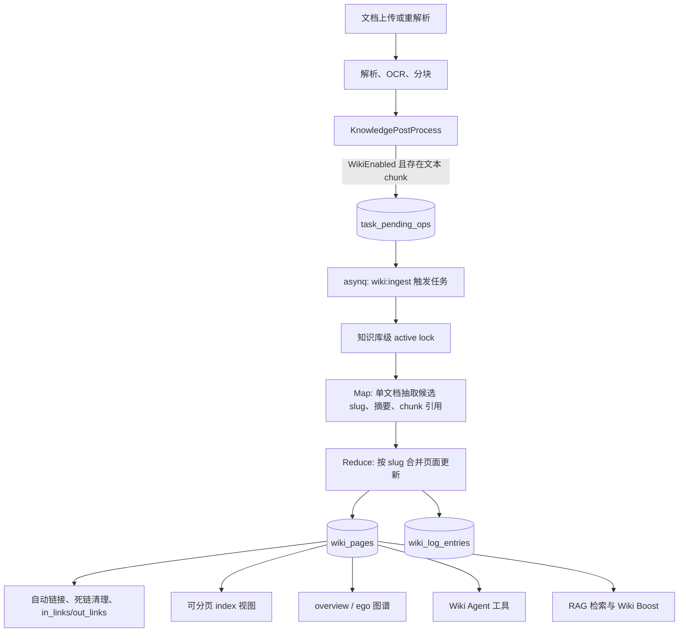

# Wiki 模式架构

Wiki 模式不是在问答时临时拼接上下文，而是在文档解析完成后，把文档内容异步整理成持久化的 Markdown 知识页、页面链接、图谱和操作日志。它适合需要“先组织知识，再浏览、检索、推理”的知识库。

从源码实现看，Wiki 模式主要由四层组成：

- 解析后处理入口：`KnowledgePostProcess` 在文档产生文本 chunk 后判断是否启用 Wiki，并把文档放入 Wiki 入库队列。
- Wiki 入库 worker：`wikiIngestService` 以知识库为粒度批量处理待入库文档，执行候选页面抽取、摘要生成、chunk 引用分类、页面合并和链接维护。
- Wiki 页面服务：`wikiPageService` 负责页面 CRUD、索引、图谱、统计、搜索、链接重建、问题记录和健康检查。
- Agent 与检索复用：Agent 工具可以读取、搜索、编辑 Wiki 页面；普通检索链路会把 Wiki 页面 chunk 作为更高质量的合成知识加权。



## 启用条件

Wiki 入库由知识库的 `IndexingStrategy.WikiEnabled` 控制。文档解析后，后处理阶段会筛出文本类 chunk；只有启用 Wiki 且存在可用文本 chunk 时，才会给该文档计入一个 Wiki 子任务并调用 `EnqueueWikiIngest`。

Wiki 使用的生成模型来自知识库 `WikiConfig.SynthesisModelID`。如果没有单独配置，会回退到 `SummaryModelID`；两者都为空时，worker 会直接报错，因为抽取、摘要和页面合成都依赖聊天模型。

`WikiConfig` 还提供几项批处理参数：

| 字段 | 用途 |
| --- | --- |
| `MaxPagesPerIngest` | 限制单次入库最多抽取或更新的页面数量。 |
| `ExtractionGranularity` | 控制候选实体/概念抽取强度，支持 `focused`、`standard`、`exhaustive`，默认 `standard`。 |
| `IngestBatchSize` | 每个 worker 批次从待处理队列取出的文档操作数，默认 5。 |
| `IngestMapParallel` | Map 阶段并行度，默认 10。 |
| `IngestReduceParallel` | Reduce 阶段并行度，默认 10。 |

## 队列和一致性

Wiki 入库的持久状态不依赖 Redis 列表，而是写入数据库表 `task_pending_ops`。每个待处理行使用：

- `task_type = "wiki:ingest"`
- `scope = "knowledge_base"`
- `scope_id = knowledge_base_id`
- `dedup_key = knowledge_id`
- `op = "ingest"` 或 `"retract"`

上传或重解析会插入 `ingest` 操作，并在低优先级队列中安排一个 30 秒后的 `wiki:ingest` 触发任务。30 秒延迟用于合并连续上传的文档。删除文档会插入 `retract` 操作，并使用较短的 5 秒延迟触发清理。

worker 运行时会先获取知识库级 active lock。Redis 可用时使用 `wiki:active:<kbID>`，TTL 为 60 秒，并每 20 秒续期；Lite 模式没有 Redis 时使用进程内锁。若已有同一知识库的 Wiki 批次在运行，新触发任务会返回并按固定 15 秒重试，避免同一个知识库并发写入页面。

批次处理还有几条防错规则：

- 从 `task_pending_ops` 取批次时按文档去重，保留同一 `knowledge_id` 的最后一个操作，避免“上传后马上删除”这类重复工作。
- 失败的单文档操作不会拖垮整个批次，而是递增 `fail_count` 并留在队列等待后续批次重试。
- 单个 pending op 超过 5 次失败后会写入 `task_dead_letters` 并从 pending 队列删除。
- asynq 触发任务本身最多重试 10 次，单次任务超时时间为 60 分钟。
- 文档删除时会写入 `wiki:deleted:<kbID>:<knowledgeID>` tombstone，TTL 为 1 小时；已排队或运行中的入库逻辑会检查 tombstone，避免为已删除文档生成新页面。

这套设计的目标是：Wiki 入库可以滞后于解析完成，但不能因为重复触发、删除竞态或 worker 重启而产生幽灵 source ref。

## Map 阶段

Map 阶段以单个文档为单位运行。它会先加载该文档的 chunk，并通过 `reconstructEnrichedContent` 重建入库文本。为了控制提示词大小，发送给 LLM 的正文最多保留 32768 个 rune。若去除图片标记后文本不足，Wiki 入库会跳过该文档，避免模型基于空文本编造实体。

Map 阶段主要做三件事：

1. 抽取候选页面 slug：先运行轻量候选抽取，得到实体和概念候选；失败时回退到旧的单轮抽取逻辑。
2. 生成文档 summary 页面：summary 页面 slug 使用 `summary/<slugify(knowledgeID)>`，而不是文件名，避免把上传文件名暴露给后续模型上下文。
3. 分类 chunk 引用：候选 slug 会被关联到具体 chunk ID，供 Reduce 阶段写入 `chunk_refs`，让页面能追溯到更细粒度的证据。

候选页面分为两类：

- `entity`：人物、组织、产品、地点等具体实体。
- `concept`：方法、主题、机制、术语等概念。

`summary` 页面由每个来源文档生成。`synthesis` 和 `comparison` 页面不会由入库自动创建，它们主要由 Agent 的 `wiki_write_page` 工具在跨文档综合、对比分析时写入。

## Reduce 阶段

Reduce 阶段按 slug 聚合更新，而不是按文档逐页写入。这样多个文档同时提到同一实体时，会汇总成一次页面修改，减少相互覆盖。

每个 slug 的更新可能是：

- 新增或更新实体/概念页。
- 新增或更新文档 summary 页。
- 从页面中撤回某个已删除文档的贡献。
- 在重解析时删除旧抽取结果中已经不再出现的 stale 页面引用。

页面更新会维护以下关键字段：

| 字段 | 含义 |
| --- | --- |
| `slug` | 知识库内唯一页面路径，例如 `entity/acme-corp`。 |
| `page_type` | 页面类型，包含 `summary`、`entity`、`concept`、`index`、`log`、`synthesis`、`comparison`。 |
| `status` | `draft`、`published` 或 `archived`。 |
| `content` | Markdown 正文，支持 `[[slug]]` 和 `[[slug|显示文本]]` 链接。 |
| `summary` | 用于索引、搜索结果和 Agent 概览的一句话摘要。 |
| `source_refs` | 贡献到该页面的来源文档 ID，兼容旧格式 `knowledgeID|title`。 |
| `chunk_refs` | 页面内容引用到的具体 chunk，重入库时会刷新。 |
| `in_links` / `out_links` | 页面之间的双向链接关系。 |
| `version` | 用户可见内容变化时递增；仅维护链接、source ref 等元数据时不递增。 |

Reduce 完成后，系统会：

- 修复本批次 summary 页面里指向生成失败页面的死链。
- 向 `wiki_log_entries` 批量写入入库或撤回日志。
- 更新 `index` 页面的简介。
- 清理本批次影响页面中的死链。
- 给本批次影响页面注入新的交叉链接。
- 将 draft 页面发布为 `published`。

## 索引页和日志

`index` 不再保存“简介 + 全量目录”的巨大 Markdown 文本。当前实现中，`index` 页面只保存 LLM 生成的简介；目录由 `GET /wiki/index` 按页面类型实时分页组装。

这个设计避免大知识库每次入库都重写一个多 MB 的 `wiki_pages.content` 字段。索引视图默认覆盖：

- `summary`
- `entity`
- `concept`
- `synthesis`
- `comparison`

每个类型独立分页，默认每组 50 条，最大 200 条。Agent 读取 `index` 时，还会把这个结构化响应压缩成适合模型阅读的 Markdown 概览，每类最多展示 20 条。

操作日志也不再存为 `log` 页面正文，而是写入 `wiki_log_entries`。日志事件包含 action、knowledge ID、文档标题、摘要、受影响页面和创建时间，接口通过 cursor 分页读取。

## 链接和图谱

页面正文中的 `[[slug]]` 会被解析为 `out_links`，目标页会同步维护 `in_links`。自动链接注入使用纯文本替换，不调用 LLM，并且会避开以下区域：

- fenced code block
- inline code
- 现有 Wiki 链接
- Markdown 普通链接和图片链接
- reference-style link
- autolink

对英文或数字边界，链接注入会检查 ASCII word boundary，避免把短词插入到更长单词内部。对中文等非 ASCII 文本，则主要依赖“长标题优先”的排序来减少误匹配。

图谱接口支持两种模式：

| 模式 | 行为 |
| --- | --- |
| `overview` | 默认模式。按 `in_links + out_links` 的链接数排序，返回 Top N 页面以及这些页面之间的边。 |
| `ego` | 以一个中心 slug 做无向 BFS，按深度返回邻域子图。 |

图谱接口还支持按页面类型过滤。HTTP handler 会限制外部请求的返回规模；内部 lint 逻辑可以请求完整页面集合用于检查。

## 删除和重解析

删除来源文档时，Wiki 清理逻辑会同时处理三类状态：

- 已存在的 Wiki 页面。
- 正在等待入库的 pending op。
- 已经触发但还在运行的 worker。

删除流程会先写 tombstone，再删除该文档的 pending `ingest` 操作。随后它会查找所有 `source_refs` 包含该文档的页面：

- 如果页面只剩这个来源，直接删除页面。
- 如果页面还有其他来源，只移除该文档的 source ref，并把页面加入撤回列表。
- 无论当前是否查到页面，都会排入一个 `retract` 操作，让 worker 在稍后再次按 source ref 查询，覆盖删除和入库之间的竞态窗口。

重解析不是删除事件。重解析时不会立即撤回旧页面，而是清理旧的 pending `ingest` 操作，等新 chunk 生成后重新排入 Wiki 入库。Map 阶段会读取该文档旧的页面 slug 集合，Reduce 阶段再决定哪些页面需要替换、撤回或删除。

## 健康检查和维护接口

Wiki 页面路由挂在：

```text
/knowledgebase/:kb_id/wiki
```

读接口要求 Viewer 及以上权限，包括页面列表、页面详情、index、log、graph、stats、search、lint、issues。写接口和维护接口要求知识库拥有者或管理员权限，包括页面创建、更新、删除、rebuild-links、auto-fix、更新 issue 状态。

Lint 会流式扫描页面，默认每批 200 条，避免大知识库一次性把所有页面正文加载到内存。它检查：

- `orphan_page`：非系统页面没有入链。
- `broken_link`：页面链接到不存在或已归档的 slug。
- `stale_ref`：`source_refs` 指向已删除文档。
- `missing_cross_ref`：页面提到某个实体/概念标题但没有链接。
- `empty_content`：正文过短。

`auto-fix` 会处理可自动修复的问题，例如把坏链还原为普通文本、归档空页面、移除 stale source ref 或删除没有其他来源的页面。修复完成后会调用 `RebuildLinks` 重新解析所有页面的入链和出链。

## Agent 复用

Agent 会根据 search target 自动判断是否存在 Wiki 知识库。只有当前会话范围内有 Wiki KB 时，才会注册 Wiki 工具；如果用户只选了普通 RAG KB，Wiki 工具会被过滤掉。

Wiki 工具包括：

- `wiki_read_page`：按 slug 读取页面，支持同名 slug 出现在多个 Wiki KB 时返回多个结果。
- `wiki_search`：搜索 Wiki 页面。
- `wiki_read_source_doc`：根据页面 source ref 读取来源文档内容。
- `wiki_flag_issue`、`wiki_read_issue`、`wiki_update_issue`：记录和处理 Wiki 页面问题。
- `wiki_write_page`：创建或完整覆盖页面，适合写 `synthesis`、`comparison` 等人工或 Agent 综合页。
- `wiki_replace_text`：局部替换页面内容。
- `wiki_rename_page`：重命名 slug。
- `wiki_delete_page`：删除页面。

如果用户在会话里 `@` 了具体文档，Agent 的 Wiki scope 会携带这些 knowledge ID。`wiki_search` 和 `wiki_read_page` 会静默过滤页面，只返回 `source_refs` 与这些文档相交的页面；`index`、`log` 这类结构性页面不会被过滤。

普通 RAG 检索也会利用 Wiki 页面。`wiki_page` 类型 chunk 在 rerank 后会获得 1.3 倍分数加权，因为它们是经过模型整理、带有交叉链接的合成知识，通常比原始 chunk 更适合作为回答上下文。

## 排障建议

排查 Wiki 入库时，优先看以下信号：

- `/wiki/stats`：确认 `pending_tasks`、`pending_issues`、`is_active`、页面总数、孤立页面数和链接数。
- `task_pending_ops`：检查是否有 `task_type="wiki:ingest"` 的积压行。
- `task_dead_letters`：检查是否有超过 Wiki 入库重试上限的文档操作。
- `wiki_log_entries`：确认最近批次是否实际写入入库或撤回事件。
- 文档解析状态：Wiki 子任务会计入 `pending_subtasks_count`，未终止的 Wiki op 会让文档停留在 `finalizing`。
- 模型配置：`WikiConfig.SynthesisModelID` 和 `SummaryModelID` 至少需要一个可用聊天模型。
- 文本质量：只有图片、OCR 失败或清洗后文本过少的文档会被跳过，避免生成幻觉页面。

如果页面链接异常，先运行 `rebuild-links` 重新解析 `[[slug]]`，再运行 `lint` 看是否仍存在 broken link、stale ref 或 orphan page。若是大知识库索引加载慢，应优先检查客户端是否使用 `/wiki/index` 的分页结构，而不是读取旧的 `index` 页面正文当作全量目录。
