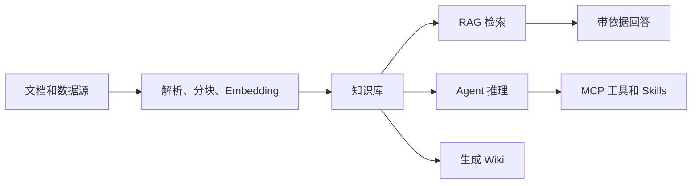

# WeKnora 是什么

WeKnora 是一个开源知识管理框架，帮助团队把分散文档转化为可检索、可推理、可持续演进的知识资产。

很多 RAG 系统只解决“上传文档然后提问”。WeKnora 更进一步，把文档入库、混合检索、Agent 工具调用、Wiki 生成、租户权限和私有化部署放在同一个框架里。

## WeKnora 提供什么

WeKnora 包含三类核心产品能力：

- **RAG 问答**：基于上传或同步的知识生成有来源依据的回答。
- **Agent 推理**：组合知识检索、MCP 工具、网络搜索和自定义 Skill 完成多步任务。
- **Wiki 生成**：把原始文档转化为相互链接的 Markdown 页面和知识图谱。

围绕这些能力，WeKnora 还提供真实知识系统需要的工程能力：

- 多租户工作区和 RBAC 权限控制。
- 支持对话、Embedding、Rerank、VLM、ASR 等不同模型角色。
- 可替换的向量库、对象存储、文档解析器、网络搜索和 IM 连接器。
- MCP 服务管理和工具审批，支持受控 Agent 执行。
- 基于 Langfuse 的模型调用、Agent 步骤和入库链路追踪。
- Web UI、REST API、CLI、MCP Server、Chrome 插件和 IM 集成。

## 适合谁使用

- 构建内部知识助手的产品和工程团队。
- 需要私有化 RAG 的企业。
- 需要受控工具调用的 Agent 应用开发者。
- 希望把文档沉淀为 Wiki 的团队。

如果你需要自托管或私有云部署，并且希望文档、凭据、模型选择和检索基础设施都在自己控制下，WeKnora 会更合适。

## 高层工作方式

1. 内容通过文件上传、URL、数据源同步或手动录入进入 WeKnora。
2. 入库链路负责解析文档、创建分块、生成 Embedding 并写入索引。
3. 用户可以通过 Web UI、API、CLI、IM 或其他客户端提问。
4. WeKnora 检索相关知识，必要时精排，然后把带依据的上下文交给模型。
5. Agent 可以进一步调用工具、搜索网络或执行经过批准的 Skill。
6. Wiki 模式可以把来源文档转化为相互链接的 Markdown 页面和知识图谱。

## 使用入口

| 入口 | 适用场景 |
| --- | --- |
| Web UI | 日常知识管理、对话、Wiki 浏览和配置 |
| REST API | 应用集成和自动化 |
| CLI | 开发者工作流和脚本操作 |
| MCP Server | 向 MCP 兼容客户端暴露 WeKnora 能力 |
| IM 渠道 | 在企业即时通讯工具里提问 |
| Chrome 插件 | 把网页内容采集到知识库 |
| 微信小程序 | 轻量移动端使用 |

## 下一步阅读

建议按这个顺序阅读：

1. [核心概念](./core-concepts.md)：理解文档里的基础术语。
2. [快速开始](./quick-start.md)：本地运行 WeKnora。
3. [架构总览](./architecture/overview.md)：理解系统组件。
4. [文档入库](./user-guide/document-ingestion.md) 和 [智能问答与 RAG](./user-guide/chat-and-rag.md)：跑通第一个端到端流程。
