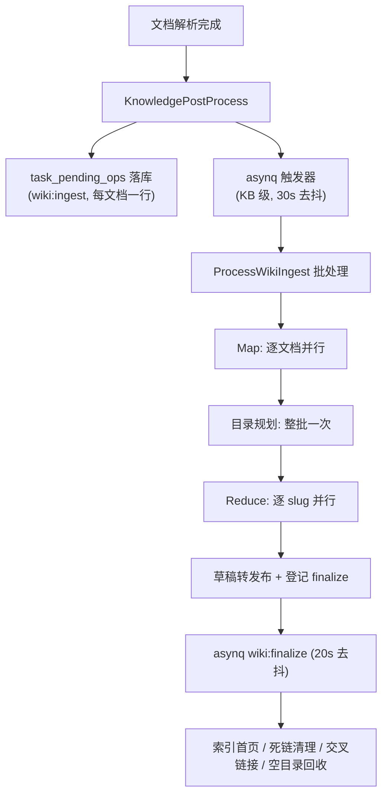
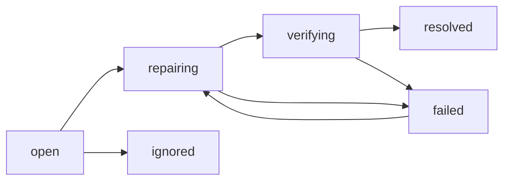

# Wiki 构建与质量巡检

本文说明两条链路：文档如何变成 Wiki 页面（**构建**），以及 Wiki 页面如何被发现问题、修复、并验证修复（**巡检**）。

- 构建：`internal/application/service/wiki_ingest*.go`
- 巡检：`internal/application/service/wiki_lint*.go`、`wiki_review*.go`

---

## 一、构建链路

Wiki 不是文档的副本，而是按**主题**重新组织的产物。一篇文档会产出一个摘要页，以及若干实体页 / 概念页；同一个实体被多篇文档提到时，它的页面被**增量合并**，而不是覆盖。



### 阶段说明

| 阶段 | 做什么 | LLM 调用 |
|------|--------|----------|
| **入队** | 每篇文档写一行 `task_pending_ops`，另发一个 KB 级去抖触发器。任务载荷里没有文档 ID，文档队列在 Postgres 里 —— 这样触发器可以合并 | 无 |
| **批处理入口** | 按 KB 领取一批待处理操作（默认 5 篇），同一文档只保留最后一次操作（先上传后删除会塌缩成删除） | 无 |
| **Map（逐文档并行）** | ① Pass 0 抽取候选实体/概念与 slug；② 生成文档摘要页；③ 分块引用（哪个 slug 由哪些 chunk 支撑）；④ 与库内已有页面做 trigram + LLM 去重，把新 slug 重定向到既有页面 | 每文档 3~4 次 |
| **目录规划** | 整批实体/概念一次性规划目录路径，复用已有文件夹 | 每 60 项 1 次 |
| **Reduce（逐 slug 并行）** | 摘要页整体覆盖；实体/概念页走"合并/回撤"提示词：加入有来源支撑的新事实、移除只由已删文档支撑的说法、保留其余内容。写入时解析 `[[slug]]` 并双向维护 `in_links` / `out_links` | 每 slug 1 次 |
| **Finalize（KB 级去抖）** | 索引首页导语、死链清理、交叉链接注入、空目录回收 | 0~1 次 |

### 一个 Wiki 页面携带的信息

`source_refs`（来自哪些文档）、`chunk_refs`（引用了哪些原文分块）、`aliases`（别名）、`out_links`/`in_links`（链接图）、`folder_id`/`category_path`（目录）、`version` + `last_edit_source`（版本与编辑来源：pipeline / user / agent / revert）。

**这些字段是巡检能力的基础**：没有 `source_refs` 就无法把页面和它的来源文档对照，没有 `chunk_refs` 就无法度量"这个摘要覆盖了原文多少"，没有链接图就无法判断两个页面是否已经被人为区分开。

---

## 二、巡检链路

### 一次巡检 = 一个 run

巡检统一走 `wiki_lint_runs`：一条持久化的运行记录，带进度、状态、错误、以及模型开销。一个 run 声明两件事：

- **mode**：`static`（规则检查）/ `ai`（AI 内容巡检）/ `full`（两者）
- **scope**：`kb`（全库）/ `page`（指定页面）

因此**全库 AI 巡检**和**单页检查**是同一套机制的两种取值，不是两份实现。并发槽位按 `(kb, scope_key)` 加锁，所以检查单个页面不会被"全库正在巡检"挡住，两次检查同一页面仍会合并成一次。

| 入口 | 说明 |
|------|------|
| `POST /wiki/lint-runs` `{mode}` | 全库巡检 |
| `POST /wiki/page-checks/*slug` `{mode}` | 单页检查 |
| `GET /wiki/lint-runs/{id}` / `latest[?slug=]` | 轮询进度；`latest` 只取全库 run，避免单页检查覆盖全库巡检的状态 |

### 第一层：规则检查（不花钱）

纯数据库与图计算，覆盖**结构性**问题：

| 规则 | 含义 | 修复方式 |
|------|------|----------|
| `broken_link` | 链接指向不存在的页面 | 规则自动改写（有唯一高置信目标时） |
| `orphan_page` | 没有任何入链 | 仅人工 |
| `empty_content` | 正文过短 | AI 修复 |
| `stale_ref` | 引用了已删除的文档 | AI 修复 |
| `missing_cross_ref` | 提到某实体却没链接（建议类，不入库） | AI 修复 |

### 第二层：AI 内容巡检 —— 按"判断单元"组织

这一层的核心结论是：**Wiki 的缺陷不在同一个层级上，只读单个页面的审查器结构性地发现不了其中大半。**

| 判断单元 | 只看这个单元才能判断的问题 |
|----------|---------------------------|
| **一个页面** | 一页混入了多个应当拆分的主题、页内自相矛盾、内容已过时、断言缺少依据 |
| **页面 + 来源文档** | 页面写错了（与来源文档矛盾）、总结不完整（来源覆盖了页面完全没提的主题） |
| **两个页面** | 两个页面其实是同一主题，应当合并 |

所以巡检是一个**检测器注册表**，每个检测器声明自己判断的单元，并且都是同样的两段式结构：

```
Candidates(cheap)  →  ledger 过滤  →  Review(1 次模型调用/单元)
   纯数据库/索引        跳过未变化的单元       小提示词、零温度、无工具
```

第一段是把 4 万页的 Wiki 收敛到十几个单元的地方，也是每个检测器领域知识所在；第二段才花钱。

| 检测器 | 单元 | 候选生成（不花钱） | 产出问题类型 |
|--------|------|-------------------|--------------|
| `page-content` | 一个页面 | 自上次审查后有改动的页面，未审查过的优先，其余按更新时间倒序 | `mixed_entities`、`contradictory_facts`、`out_of_date`、`unsupported_claim` |
| `source-grounding` | 页面 + 来源文档 | 有 `source_refs` 且有改动的页面；提示词里带上"引用了原文 N/M 段" | `factual_error`、`incomplete_summary` |
| `duplicate-pages` | 两个页面 | ① 标题 trigram 相似（复用构建期去重用的同一个索引）；② 同一来源文档产出的兄弟页面。已互相链接的对子直接丢弃 —— 有人链接过就说明已经区分开了 | `duplicate_pages` |

`duplicate-pages` 特别说明：全量两两比较是 O(n²)，不可行。所以整个检测器本质上就是它的候选生成器 —— 用两个廉价信号把"可能重复"的对子挑出来，每对只花一次调用。对子按 slug 规范排序，两个方向塌缩成同一个单元、同一个问题、同一条 ledger。

### 成本是如何被限住的

一次全库 AI 巡检的开销上限是**可预测的**，因为：

1. **每次 run 有调用预算**（默认 24，硬上限 240，知识库可配）。预算按权重分配给各检测器，每个检测器**至少保底 1 次**；用不完的份额释放给后面的检测器 —— 所以没有重复页面的 Wiki 不会把预算浪费在这个检测器上。加检测器只改变一次 run 看什么，不改变它花多少钱。
2. **ledger 跳过未变化的单元**。`wiki_review_ledger` 按 `(detector, unit)` 记录 unit_hash，输入没变就直接从数据库回答。所以重复巡检一个没改动的 Wiki 几乎是免费的，UI 上会明确显示"N 个单元内容未变化，已跳过"，而不是谎称"审查后没发现问题"。
3. **单次调用被裁剪**：正文截断、来源节选上限、零温度、限制补全长度、无工具、无检索、并发 2、单次 90s 超时。
4. **可选更便宜的模型**：`wiki_config.lint_model_id` 与修复模型分开配置，未配置时回退到修复模型。

### 结果可信度：为什么要求逐字引用

所有对"某段文字有问题"的判定，都必须**逐字引用**页面原文。这一条同时解决三件事：

- **过滤幻觉**：引用在页面里找不到，说明这个判定是编的，直接丢弃。
- **给出稳定身份**：问题的 fingerprint 由引用片段（归一化后）决定，所以重复巡检同一页面是更新既有问题，而不是堆出一批近似重复。
- **让修复可验证**（见下）。

此外还有：类型白名单（模型不能发明 UI 无法标注的类别）、置信度阈值、每单元最多 3 条。对"整页/整对"的判定（`incomplete_summary`、`duplicate_pages`）不要求引用，而是用单元自身作为身份。

---

## 三、闭环：修复与验证



修复分两条路：**规则自动修复**（断链改写）和 **Wiki 修订智能体**（其余）。智能体带 `wiki_read_issue` / `wiki_read_source_doc` / `wiki_write_page` / `wiki_replace_text` / `wiki_rename_page` / `wiki_merge_pages` / `wiki_update_issue` 等工具，问题的 evidence 里带着引用片段、修复建议、来源文档，智能体读得到。

### 验证不是"版本号变了就算好"

关闭一个问题前必须通过**后置条件**。每类问题都先走一条**确定性、零成本**的检查，只有它无法定论时才花一次复检调用：

| 问题类型 | 确定性检查 |
|----------|-----------|
| `broken_link` / `stale_ref` | 那个链接/引用是否还在 |
| `orphan_page` | 是否有了入链 |
| `empty_content` | 正文是否达到阈值 |
| 引用锚定的内容问题 | 被引用的原文片段是否已被改写（常见情况就是被改写了，所以通常零成本） |
| `incomplete_summary` | 页面是否**真的**吸收了更多来源：正文增长 ≥15% 或引用分块数增加。仅仅换个说法会被拒 |
| `duplicate_pages` | 两页是否已合并（一页消失/归档），或已互相链接（人为判定为不同主题） |

只有"引用片段还在，但页面其他地方改了"这种真正含糊的情况（矛盾可以从任一侧解决），才对该单元做**一次**复检调用；复检用 fingerprint 判等 —— "还在"意味着检测器对同一个东西给出了同一个判定，而不只是它又找到了点什么。没配模型或复检失败时，回退到"页面必须真的推进过"，绝不静默放过。

### 重复页面为什么需要专门的合并工具

用"改写 A + 删除 B"手工合并会丢掉 B 的 `aliases` / `source_refs` / `chunk_refs`，于是**下一次同批文档入库时重复页面会被重新造出来**，问题原地复发。`wiki_merge_pages` 做的是转移而不是删除：幸存页吸收对方的别名（含标题）、来源文档、引用分块，入链被改指过来，之后才删除被合并页。写入顺序是先更新幸存页再删除对方 —— 中间失败会留下"已合并的页 + 仍存在的重复页"，杂乱但可重新检出、可恢复，而不是把内容删进虚空。

### 消解（reconcile）：谁有权关闭"已消失"的问题

一次 run 只看了 Wiki 的一小片，所以"这次没报"绝不能推广成"问题没了"。消解按三个维度收窄：

- **来源**：规则检查只能关闭规则类问题，AI 巡检只能关闭 AI 类问题。
- **类型**：只能关闭本次实际执行的检测器所负责的类型。
- **范围**：引用锚定的问题，按其检测器**实际读过的页面**关闭（读了这一页就等于重新检查了这一页上所有这类问题）；关于"对子/页面+来源"的问题，只能由**那个确切单元**按 fingerprint 关闭 —— 否则审查了 (A, C) 会误关掉关于 (A, B) 的问题。

规则检查若中途失败则完全不消解：按缺席关闭问题，只有在整轮走完之后才是成立的。

---

## 四、配置

| 配置项 | 位置 | 说明 |
|--------|------|------|
| `wiki_config.repair_model_id` | 知识库设置 | AI 修复模型，AI 修复必需 |
| `wiki_config.lint_model_id` | 知识库设置 | AI 巡检模型，留空回退到修复模型 |
| `wiki_config.lint_ai_max_pages` | 知识库设置 | 单次 AI 巡检的调用预算，0 用默认值（24） |
| `wiki_config.lint_ai_detectors` | 知识库配置 | 允许运行的检测器 id 白名单，留空为全部 |
| `wiki_config.content_instructions` | 知识库设置 | 同时作为巡检的编辑规范上下文（只能收窄判定，不能新增问题类型） |

## 五、扩展：新增一类问题

1. 想清楚它的**判断单元**是什么 —— 这决定了它属于哪个检测器，或者需要一个新检测器。
2. 在 `internal/types/wiki_page.go` 加问题类型常量。
3. 若需新检测器：实现 `wikiReviewDetector`（`ID` / `IssueTypes` / `Weight` / `Candidates` / `Review` / `Identity` / `UnitFingerprints`），注册进 `wikiReviewDetectors()`。**候选生成必须是廉价的数据库工作**。
4. 在 `Identity()` 里声明该类型是引用锚定还是单元标识 —— 这是消解正确性的前提。
5. 加确定性后置条件（`wikiAICheapPostcondition`）。
6. 前端：`issueMeta.ts` 加标签与图标，四种语言加 i18n。
7. 若需要新的修复手段，给 Wiki 修订智能体加工具，并在其系统提示词里写清何时用。

## 相关页面

- [知识图谱](知识图谱.md)
- [MCP功能使用说明](MCP功能使用说明.md)
