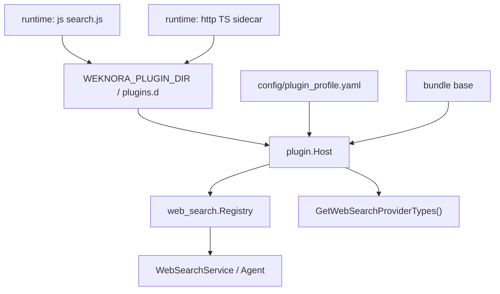

# 插件化架构

WeKnora 正在把「扩展点写进主仓库、注册写进 `container.go`」收成一套 **Everything is a Plugin** 组合核，思路来自 [DeepSeek Harness](https://github.com/deepseek-ai/deepseek-harness) / Cordis，实现按 Go 单体做了裁剪。完整对照与分阶段计划见仓库内 [`docs/dev/plugin-architecture.md`](https://github.com/Tencent/WeKnora/blob/main/docs/dev/plugin-architecture.md)。

九条业务缝的接口清单仍以[扩展点指南](./03-extension-points.md)为准。本章只讲 **进程级组合**：如何在不改 `internal/container/container.go`、也不重新编译的前提下启用、关闭、替换一条能力。

## 1. 和「扩展点」的差别

扩展点回答「要实现哪个接口」。插件核回答：

- 谁在启动时被挂上（profile / bundle / 磁盘目录）
- 依赖哪个服务 key（`inject`，例如 `web_search`）
- 卸载时如何撤销注册（reversible effect）

Go 不能像 TypeScript 那样 `pnpm add` 完在同一进程 `import()`。接近的手感是：往 `plugins.d/` 丢 `plugin.yaml` + `search.js`，或用 TS 写一个 HTTP sidecar。问答流水线里的 `chat_pipeline.Plugin` 仍是请求级 waterfall，暂时不动。



## 2. 当前已迁到 Host 的缝

| 缝 | 内置插件 id | 服务 key | 旧注册点 |
| --- | --- | --- | --- |
| 联网搜索 | `websearch.duckduckgo` … `websearch.metaso` | `web_search` | `container.registerWebSearchProviders`（已删除） |

磁盘插件还会把自己的 `provider` 写进 `/api/v1/web-search-providers/types`，前端下拉能看到。

## 3. 组合文件与环境变量

| 变量 | 默认 | 作用 |
| --- | --- | --- |
| `WEKNORA_PLUGIN_DIR` | `plugins.d` | 扫描 `plugin.yaml`；`none` 关闭 |
| `WEKNORA_PLUGIN_PROFILE` | `config/plugin_profile.yaml` | 主 profile |
| `WEKNORA_PLUGIN_PATCH` | 空 | 额外 overlay YAML |
| `WEKNORA_PLUGINS` | 空 | 逗号分隔 factory id，insert-if-missing |

仓库自带 `plugins.d/websearch-js-echo/`（丢文件即用）和 `plugins/sdk-ts/websearch/`（TS sidecar 协议）。

## 4. 新增一个联网搜索插件

**免编译（推荐）：** 新建 `plugins.d/mysearch/plugin.yaml`：

```yaml
id: websearch.mysearch
name: My Search
seam: web_search
runtime: js          # 或 http
entry: search.js     # js
# endpoint: http://127.0.0.1:9101/search   # http
provider: mysearch
```

`search.js` 导出 `function search(query, maxResults, includeDate, params)`，需要出网时调用宿主给的 `httpRequest`（走 SSRF 白名单）。HTTP 运行时的 JSON 协议见 `plugins/sdk-ts/websearch/README.md`。

**内置引擎：** `internal/plugin/websearch` 的 `builtins()` 加一行。不要改 `container.go`。

## 5. 明确不抄的部分

- 不用 Go `plugin.Open`（`.so`）做社区分发。
- 不替换 uber/dig：dig 继续管 Handler / Service / DB。
- 安全策略（RBAC、SSRF、配额）不是可卸载插件。
- 没有 Cordis 式 HMR：改磁盘插件后重启进程。
