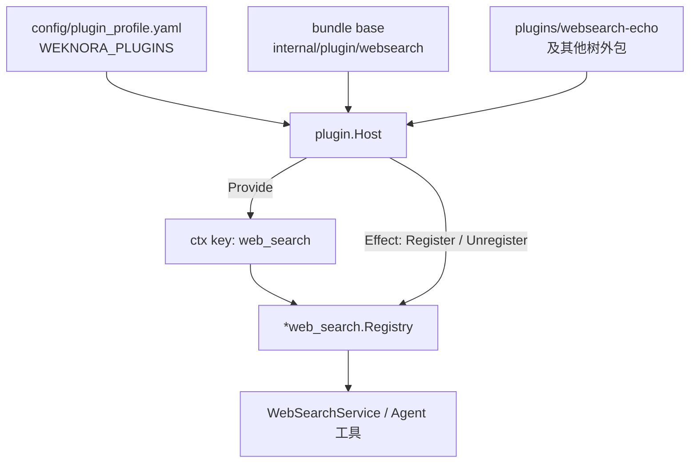

# 插件化架构

WeKnora 正在把「扩展点写进主仓库、注册写进 `container.go`」收成一套 **Everything is a Plugin** 组合核，思路来自 [DeepSeek Harness](https://github.com/deepseek-ai/deepseek-harness) / Cordis，实现按 Go 单体做了裁剪。完整对照与分阶段计划见仓库内 [`docs/dev/plugin-architecture.md`](https://github.com/Tencent/WeKnora/blob/main/docs/dev/plugin-architecture.md)。

九条业务缝的接口清单仍以[扩展点指南](./03-extension-points.md)为准。本章只讲 **进程级组合**：如何在不改 `internal/container/container.go` 的前提下启用、关闭、替换一条能力。

## 1. 和「扩展点」的差别

扩展点回答「要实现哪个接口」。插件核回答：

- 谁在启动时被挂上（profile / bundle / patch）
- 依赖哪个服务 key（`inject`，例如 `web_search`）
- 卸载时如何撤销注册（reversible effect）

问答流水线里的 `chat_pipeline.Plugin` 是 **请求级 waterfall**，暂时保持不动；它和进程级 Host 会在后续阶段合流。



## 2. 当前已迁到 Host 的缝

| 缝 | 内置插件 id | 服务 key | 旧注册点 |
| --- | --- | --- | --- |
| 联网搜索 | `websearch.duckduckgo` … `websearch.metaso` | `web_search` | `container.registerWebSearchProviders`（已删除） |

数据源、IM、检索引擎、存储、模型、工具、分块、解析器仍按扩展点指南的旧注册点接入；迁移顺序见设计文档第 5 节。

## 3. 组合文件与环境变量

默认 profile：`config/plugin_profile.yaml`。

```yaml
name: standard
bundles:
  - base
# patch:
#   - id: websearch.exa
#     disabled: true
#   - id: websearch.echo
#     plugin: websearch.echo
#     insert: true
```

| 变量 | 默认 | 作用 |
| --- | --- | --- |
| `WEKNORA_PLUGIN_PROFILE` | `config/plugin_profile.yaml` | 主 profile |
| `WEKNORA_PLUGIN_PATCH` | 空 | 额外 overlay YAML（读取其中的 `patch`） |
| `WEKNORA_PLUGINS` | 空 | 逗号分隔 factory id，缺失则插入 |

启用仓库自带样板（把查询原样当成一条搜索结果，只用于验证组合核）：

```bash
WEKNORA_PLUGINS=websearch.echo
```

## 4. 新增一个联网搜索插件

**内置引擎**（仍在本仓库）：实现 `interfaces.WebSearchProvider`，在 `internal/plugin/websearch` 的 `builtins()` 加一行，并补类型元数据。不要再改 `container.go`。

**树外 / 社区插件**：复制 `plugins/websearch-echo/`，`plugin.Register("websearch.mysearch", factory)`，在 `internal/plugin/boot` 增加一行 blank import（Go 编译期目录），再用 profile 或 `WEKNORA_PLUGINS` 启用。

内核 API 在 `internal/plugin`：`Plugin`、`Context.Provide` / `Effect`、`EventBus`（emit / waterfall / parallel / serial）、`Host.Compose`。

## 5. 明确不抄的部分

- 不用 Go `plugin.Open`（`.so`）做社区分发。
- 不替换 uber/dig：dig 继续管 Handler / Service / DB，Host 只管可替换能力。
- 安全策略（RBAC、SSRF、配额）不是可卸载插件。
